## scRNAseq Analyses

### Part 1. Cell identification

```R
suppressPackageStartupMessages({
  library(dplyr)
  library(Seurat)
  library(Matrix)
  library(proxy)
  library(gplots)
  library(Rtsne)
  library(densityClust)
  library(irlba)
  library(monocle)
  library(plyr)
  library(DOSE)
  library(clusterProfiler)
  library(topGO)
  library(pathview)
  library(AnnotationDbi)
  library(cowplot)
  library(ggplot2)
  library(velocyto.R)
  library(trqwe)
  library(Rsamtools)
  library(GenomicFeatures)
  library(GenomicAlignments)
  library(BiocParallel)
  library(pheatmap)
  library(RColorBrewer)
  library(PoiClaClu)
  library(org.Mm.eg.db)
  library(org.Hs.eg.db)
  library(DESeq2)
  library(data.table)
  library(stringr)
  library(iTALK)
  library(nichenetr)
  library(tidyr)
  library(URD)
  library(scExtras)
  library(plotly)
})
library(future)
library(future.apply)
options(future.globals.maxSize = 300 * 1024^3)
plan("multiprocess", workers = 15)
plan()
library(scales)
library(BuenColors)
```

```R
Sub.data <- Read10X(data.dir ="./Sub_filtered_feature_bc_matrix")
Sub_object <- CreateSeuratObject(counts = Sub.data, project = "sub", min.cells = 3, min.features = 200)
Sub_object$sample <- Idents(object = Sub_object)
Orth.data <- Read10X(data.dir = "./Insitu_filtered_feature_bc_matrix")
Orth_object <- CreateSeuratObject(counts = Orth.data, project = "insitu", min.cells = 3, min.features = 200)
Orth_object$sample <- Idents(object = Orth_object)
merge.data <- merge(x = Sub_object, y = Orth_object)
merge_object <- CreateSeuratObject(counts =GetAssayData(object = merge.data, slot = "counts",assay="RNA")[,rownames(merge.data@meta.data)], meta.data = merge.data@meta.data)
merge_object[["percent.mt"]] <- PercentageFeatureSet(merge_object, pattern = "^mt-")
merge_subset <- subset(merge_object, subset = nFeature_RNA > 0 & nFeature_RNA < 7500 & percent.mt < 25)
merge_normalize <- NormalizeData(merge_subset)
merge_normalize_variable_features <- FindVariableFeatures(merge_normalize, selection.method = "vst", nfeatures = 7500)
all.genes <- rownames(merge_normalize_variable_features)
merge_variable_scale <- ScaleData(merge_normalize_variable_features,verbose = TRUE, vars.to.regress = c("nCount_RNA","orig.ident"))
merge_pca <- RunPCA(merge_variable_scale, features = VariableFeatures(object = merge_variable_scale))
merge_JackStraw <- JackStraw(merge_pca, num.replicate = 100)
merge_ScoreJackStraw <- ScoreJackStraw(merge_JackStraw, dims = 1:20)
merge_FindNeighbors <- FindNeighbors(merge_ScoreJackStraw, dims = 1:10)
merge_FindClusters <- FindClusters(merge_FindNeighbors, resolution = 0.1)
Sub_and_Orth_all_cells <- RunUMAP(merge_FindClusters, dims = 1:20)
```

```R
#Finding markers to identify cell types 
all.markers <- FindAllMarkers(Merge_umap_res20, only.pos = TRUE, min.pct = 0.25, logfc.threshold = 0.25)
write.csv(all.markers,"Cell_Cluster_FindAllMarkers.csv")
```


```R
Sub_and_Orth_all_cells <- readRDS("./0_Sub_and_Orth_all_cells.rds")
Idents(Sub_and_Orth_all_cells) <- Sub_and_Orth_all_cells$CellType
p1 <- DimPlot(Sub_and_Orth_all_cells, reduction = "umap", group.by = "orig.ident",label = FALSE,pt.size=0.8,label.size=8)
p2 <- DimPlot(Sub_and_Orth_all_cells, reduction = "umap", label = TRUE,pt.size=0.8,label.size=8
ff <- plot_grid(p1, p2)
ggsave(ff,file="Fig4_Dimplot_Mergeallcells_umap.png",width=14,dpi=1080)
```


```R
Idents(Sub_and_Orth_all_cells) <- factor(Idents(Sub_and_Orth_all_cells), levels = c("Tumor", "Neutrophil","Macrophage","Gastric mucosa","Fibroblast","Endothelial"))
markers.to.plot <- c("LUCI2LTR","CAS9","V2TC","S100a9","S100a8","G0s2","Lyz2","Cd68","Csf1r","Gkn2","Tff1","Tff2","Dcn","Pdpn","Vwf","Eng","Egfl7","Pecam1")
ff <- DotPlot(Sub_and_Orth_all_cells, features = c("LUCI2LTR","CAS9","V2TC","S100a9","S100a8","G0s2","Lyz2","Cd68","Csf1r","Gkn2","Tff1","Tff2","Dcn","Pdpn","Vwf","Eng","Egfl7","Pecam1"),dot.scale = 5,cols = c("#ffffff","#cb181d")) + RotatedAxis()
ggsave(ff,file="Fig4_marker_dotplot.png",width=8,height=3)
```

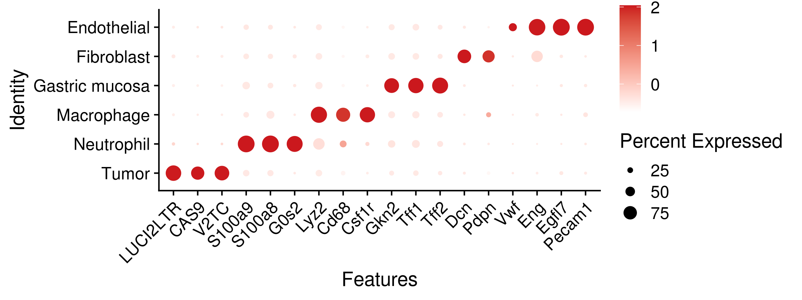

```R
ff <- FeaturePlot(Sub_and_Orth_all_cells, features = c("Pecam1","Col1a1","Tff1","Csf1r","S100a9","CAS9","LUCI2LTR","V2TC"),order=TRUE,pt.size=0.2,cols = CustomPalette(low ="#007BBF", mid = "#FFF485",high = "#FF0000"),ncol=4)
ggsave(ff,file="FigS4_FeaturePlot_Cell_Identification.png",width=12,height=6)
```

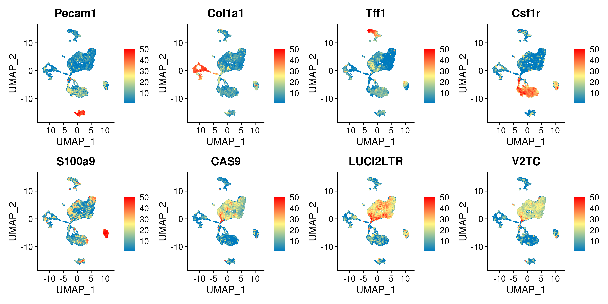


```R
cell_type <- data.frame(Sub_and_Orth_all_cells@active.ident)
names(cell_type) <- "cell_type"
cell_type$barcodes <- rownames(cell_type)
meta.data <- as.data.frame(Merge_umap_res20_rename[[]])
meta.data$cell_type <- cell_type$cell_type
y <- meta.data[,1]
insitu_metadata <- meta.data[with(meta.data,y=="in_situ"),]
y <- meta.data[,1]
sub_metadata <- meta.data[with(meta.data,y=="sub"),]
cluster_all <- c()
celltype <- c("Tumor","Macrophage","Fibroblast","Gastric mucosa","Neutrophil","Endothelial")
i <- c(1:6)
for (i in celltype[i]){
y <- insitu_metadata[,8]
insitu_cluster <- insitu_metadata[with(insitu_metadata,y==i),]
y <- sub_metadata[,8]
sub_cluster <- sub_metadata[with(sub_metadata,y==i),]
insitu_per <- nrow(insitu_cluster)/nrow(insitu_metadata)
sub_per <- nrow(sub_cluster)/nrow(sub_metadata)
aa <- as.data.frame(c(insitu_per,sub_per))
rownames(aa) <- c("insitu_per","sub_per")
colnames(aa) <- paste("clu",i,sep="_")
aa <- as.data.frame(t(aa))
cluster_all <- rbind(cluster_all,aa)
print(paste("clu",i,"is done",sep=" "))
}
cluster_all <- round(cluster_all,3)
cluster_all
cluster_all$cluster <- rownames(cluster_all)
cluster_all_1 <- data.frame(cluster_all)
denominator <- cluster_all_1$insitu_per+cluster_all_1$sub_per
insitu_ratio <- cluster_all_1$insitu_per/denominator
sub_ratio <- cluster_all_1$sub_per/denominator
cluster <- cluster_all_1$cluster
insitu_cluratio <- data.frame(cbind(insitu_ratio,cluster))
insitu_cluratio$ratio <- insitu_cluratio$insitu_ratio
insitu_cluratio <- insitu_cluratio[,-1]
insitu_cluratio$sample <- "insitu"
sub_cluratio <- data.frame(cbind(sub_ratio,cluster))
sub_cluratio$ratio <- sub_cluratio$sub_ratio
sub_cluratio <- sub_cluratio[,-1]
sub_cluratio$sample <- "sub"
percentage_cluster <- rbind(insitu_cluratio,sub_cluratio)
write.csv(percentage_cluster,"Fraction_of_cellTypes.csv")
percentage_cluster <- read.csv("./Fraction_of_cellTypes.csv")
percentage_cluster$cluster = factor(percentage_cluster$cluster, levels=c("clu_Gastric mucosa","clu_Tumor","clu_Fibroblast","clu_Endothelial","clu_Macrophage","clu_Neutrophil")) 
ff <- ggplot(percentage_cluster,aes(cluster,ratio,fill=sample))+geom_bar(stat ="identity",position="stack")+
labs(title="",y="Fraction of cellTypes")+
theme(plot.title = element_text(size=20,face = "bold"),axis.text.y=element_text(size=15),
axis.text.x=element_text(size=10),axis.title.y=element_text(size=15,face="bold"),axis.title.x=element_text(size=15,face="bold"))+ theme(axis.text.x=element_text(angle=45, hjust=1))
ggsave(ff,file="Fig4_Fraction_of_cellTypes.png",width =5, height = 5,dpi=1080)
```

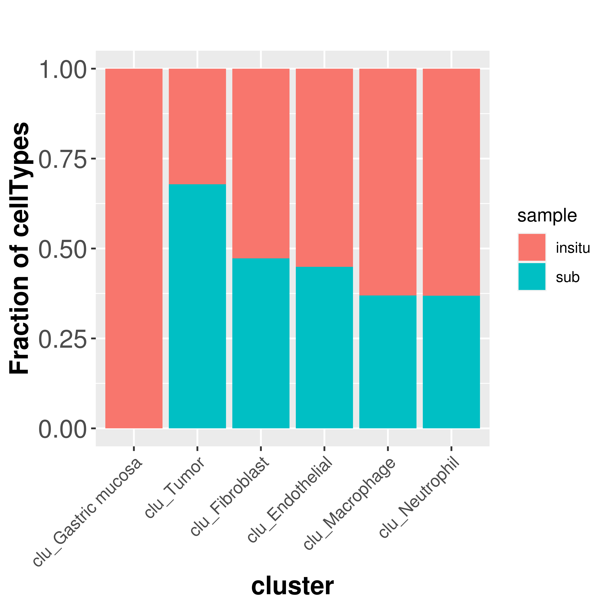


```R
$$$$$$$$$$$$$$$$$$$$$$$$$$$$$$$$$$$
GC Adencarcinoma Signatures
$$$$$$$$$$$$$$$$$$$$$$$$$$$$$$$$$$$
CCR_Tumor_Normal_Epi_diff_to_mouse <- read.csv("./CCR_Tumor_Normal_Epi_DEGs.csv")
CCR_Tumor_sig <- subset(CCR_Tumor_Normal_Epi_diff_to_mouse,p_val_adj < 0.05)
CCR_Tumor_sig <- CCR_Tumor_sig[order(CCR_Tumor_sig$avg_logFC,decreasing=TRUE),]
sle_data <- as.data.frame(t(GetAssayData(object = Sub_and_Orth_all_cells, slot = "scale.data",assay="RNA")))
sle_data1 <- sle_data[,intersect(colnames(sle_data),as.character(CCR_Tumor_sig$MGI.symbol[1:50]))]
only_Tumor <- rownames(subset(Sub_and_Orth_all_cells@meta.data,CellType=="Tumor"))
Cor_CCR50=as.numeric(as.character(colMeans(sle_data1[only_Tumor,])))
sle_data2 <- as.data.frame(t(sle_data1))

sel_data1 <- data.frame(Cor_CCR50,sle_data2)
sel_data_cor <- future_lapply(2:ncol(sel_data1),function(x) {
tmp <- cor(x=sel_data1[,1],y = sel_data1[,x],method = c("spearman"))
tmp_test <- cor.test(x=sel_data1[,1],y = sel_data1[,x])
cor_tmp <- data.frame(cor_num=tmp,pval=tmp_test$p.value,row.names=colnames(sel_data1)[x])
return(cor_tmp)
})
sel_data_cor <- as.data.frame(rbindlist(sel_data_cor))
rownames(sel_data_cor) <- colnames(sel_data1)[-1]
colnames(sel_data_cor)[1] <- "Cor_CCR50"
Sub_and_Orth_all_cells$Cor_CCR50 <- sel_data_cor$Cor_CCR50

aa <- FeaturePlot(object = Sub_and_Orth_all_cells, features = c("Cor_CCR50"),pt.size=0.3, ncol=1,
 reduction="umap",label=T,cols = CustomPalette(low ="#007BBF", mid = "#FFF485",high = "#FF0000"))
ggsave("Fig4_Adencarcinoma_Signatures.png", plot=aa,width = 5, height = 5,dpi=1080)
```

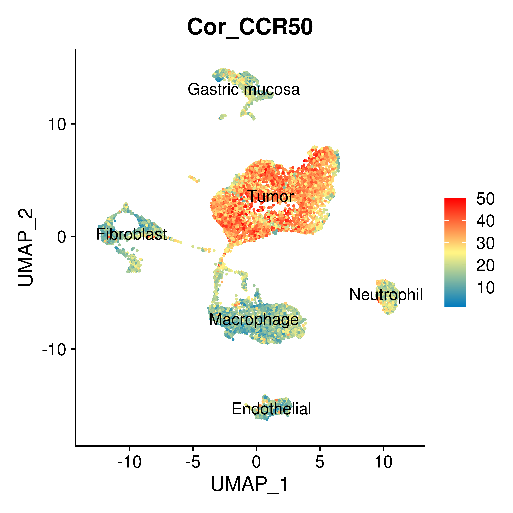

### Part 2. Tumor and microenvironment cells analyses

```R
Mouse_Tumor_cells <- readRDS("./Orth_and_Sub_Tumor_cells.rds")
subset_cluster <- RunDiffusion(Mouse_Tumor_cells)
seuratToURD2 <- function(seurat.object) {
  if (requireNamespace("Seurat", quietly = TRUE)) {
    # Create an empty URD object
    ds <- new("URD")
    # Copy over data
    ds@logupx.data <- as(as.matrix(seurat.object@assays$RNA@data), "dgCMatrix")
    if(!any(dim(seurat.object@assays$RNA@counts) == 0)) ds@count.data <- as(as.matrix(seurat.object@assays$RNA@counts[rownames(seurat.object@assays$RNA@data), colnames(seurat.object@assays$RNA@data)]), "dgCMatrix")
    # Copy over metadata
    ## TO DO - grab kmeans clustering info
    get.data <- NULL
    if (.hasSlot(seurat.object, "data.info")) { 
      get.data <- as.data.frame(seurat.object@assays$RNA@data.info)
    } else if (.hasSlot(seurat.object, "meta.data")) { 
      get.data <- as.data.frame(seurat.object@meta.data) 
    }
    if(!is.null(get.data)) {
      di <- colnames(get.data)
      m <- grep("res|cluster|Res|Cluster", di, value=T, invert = T) # Put as metadata if it's not the result of a clustering.
      discrete <- apply(get.data, 2, function(x) length(unique(x)) / length(x))
      gi <- di[which(discrete <= 0.015)]
      ds@meta <- get.data[,m,drop=F]
      ds@group.ids <- get.data[,gi,drop=F]
    }
    # Copy over var.genes
    if(length(seurat.object@assays$RNA@var.features > 0)) ds@var.genes <- seurat.object@assays$RNA@var.features
    # Move over tSNE projection
    if (.hasSlot(seurat.object, "tsne.rot")) {
      if(!any(dim(seurat.object@tsne.rot) == 0)) {
        ds@tsne.y <- as.data.frame(seurat.object@tsne.rot)
        colnames(ds@tsne.y) <- c("tSNE1", "tSNE2")
      }
    } else if (.hasSlot(seurat.object, "reductions")) {
      if(("tsne" %in% names(seurat.object@reductions)) && !any(dim(seurat.object@reductions$tsne) == 0)) {
        ds@tsne.y <- as.data.frame(seurat.object@reductions$tsne@cell.embeddings)
        colnames(ds@tsne.y) <- c("tSNE1", "tSNE2")
      }
    }
    # Move over PCA results
    if (.hasSlot(seurat.object, "pca.x")) {
      if(!any(dim(seurat.object@pca.x) == 0)) {
        ds@pca.load <- seurat.object@pca.x
        ds@pca.scores <- seurat.object@pca.rot
        warning("Need to set which PCs are significant in @pca.sig")
      }
      ## TO DO: Convert SVD to sdev
    } else if (.hasSlot(seurat.object, "reductions")) {
      if(("pca" %in% names(seurat.object@reductions)) && !any(dim(Loadings(seurat.object, reduction = "pca")) == 0)) {
        ds@pca.load <- as.data.frame(Loadings(seurat.object, reduction = "pca"))
        ds@pca.scores <- as.data.frame(seurat.object@reductions$pca@cell.embeddings)
        ds@pca.sdev <- seurat.object@reductions$pca@stdev
        ds@pca.sig <- pcaMarchenkoPastur(M=dim(ds@pca.scores)[1], N=dim(ds@pca.load)[1], pca.sdev=ds@pca.sdev)
      }
    }
    return(ds)
  } else {
    stop("Package Seurat is required for this function. To install: install.packages('Seurat')\n")
  }
}
all_URD <- seuratToURD2(subset_cluster)
tumor_URD_si25 <- calcDM(all_URD, sigma=25)
DC1 <- as.data.frame(tumor_URD_si25@dm$DC1)
DC2 <- as.data.frame(tumor_URD_si25@dm$DC2)
RUD_POS <- cbind(DC1,DC2)
tsne_info <- subset_cluster[["dm"]]@cell.embeddings 
RUD_POS <- RUD_POS[rownames(tsne_info),]
colnames(RUD_POS) <- paste("DM",1:2,sep="_")
subset_cluster[["dm"]]@cell.embeddings <- as.matrix(RUD_POS)
Tumor_cells <- FindClusters(subset_cluster, resolution = 0.05)

Idents(Tumor_cells) <- Tumor_cells$orig.ident
Idents(Tumor_cells) <- factor(Idents(Tumor_cells), levels = c("sub","in_situ"))
p1 <- DimPlot(Tumor_cells, reduction = "dm",pt.size=0.9,cols=c("#6baed6","#ef3b2c"),order=TRUE)
ggsave(p1,file="Fig4_TumorCells_sample_origins.png",width=6.5,height=6.5,dpi=1080)

Idents(Tumor_cells) <- Tumor_cells$RNA_snn_res.0.05
Idents(Tumor_cells) <- factor(Idents(Tumor_cells), levels = c("1","0"))
p2 <- DimPlot(Tumor_cells, reduction = "dm",label = TRUE,pt.size = 1,label.size = 8,cols=c("#5aae61","#9970ab"))
ggsave(p2,file="Fig4_TumorCells_sucluster.png",width=6.5,height=6.5,dpi=1080)
```

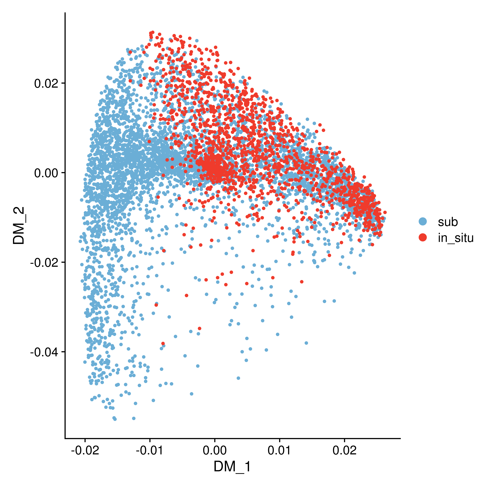


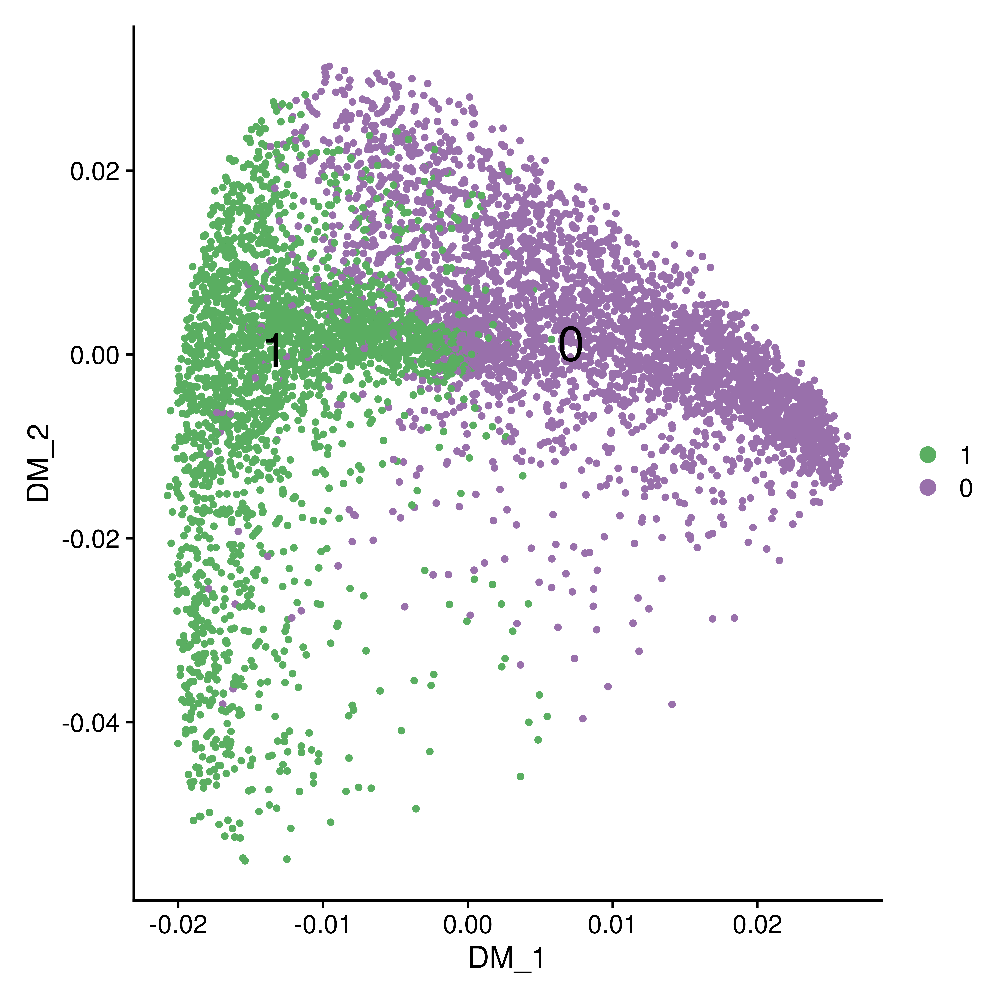

```R
$$$$$$$$$$$$$$$$$$$$$$$$$$$$$$$$
patient data (TCGA_STAD)
$$$$$$$$$$$$$$$$$$$$$$$$$$$$$$$$
TCGA_STAD <- fread("./TCGA-STAD_RNA_expr.csv",sep=",")
TCGA_STAD <- as.data.frame(TCGA_STAD)
TCGA_STAD <- na.omit(TCGA_STAD)
rownames(TCGA_STAD) <- TCGA_STAD$V1
TCGA_STAD <- TCGA_STAD[,-1]
library(org.Hs.eg.db)
library(AnnotationDbi)
TCGA_STAD$symbol <- mapIds(x = org.Hs.eg.db,
                        keys = rownames(TCGA_STAD),
            keytype ="ENSEMBL",
            column ="SYMBOL",
            multiVals="first")
TCGA_STAD <- na.omit(TCGA_STAD)
TCGA_STAD <- TCGA_STAD[!duplicated(TCGA_STAD$symbol),]
rownames(TCGA_STAD) <- TCGA_STAD$symbol
TCGA_STAD <- TCGA_STAD[,-ncol(TCGA_STAD)]
colnames(TCGA_STAD) <- substring(colnames(TCGA_STAD),1,15)
TCGA_STAD <- as.data.frame(t(TCGA_STAD))
TCGA_STAD1 <- TCGA_STAD
TCGA_STAD1 <- log(TCGA_STAD+1,2)
TCGA_STAD1 <- t(apply(TCGA_STAD1, 1, function(x) (x-mean(x))/sd(x)))
TCGA_STAD1 <- as.data.frame(t(TCGA_STAD1))
TCGA_STAD1 <- TCGA_STAD1[apply(TCGA_STAD1,1,sd)!=0,]

TCGA_STAD_clinical_sample <- read.csv("./data_bcr_clinical_data_sample.txt",sep="\t")
TCGA_STAD_clinical_sample <- TCGA_STAD_clinical_sample[-c(1:4),]
head(TCGA_STAD_clinical_sample)
rownames(TCGA_STAD_clinical_sample) <- TCGA_STAD_clinical_sample$X.Sample.Identifier
TCGA_STAD_clinical_patient <- read.csv("/mnt/data/user_data/xiangyu/workshop/GC_models_TME/stad_tcga/stad_tcga/data_bcr_clinical_data_patient.txt",sep="\t")
TCGA_STAD_clinical_patient <- TCGA_STAD_clinical_patient[-c(1:4),]
head(TCGA_STAD_clinical_patient)
rownames(TCGA_STAD_clinical_patient) <- TCGA_STAD_clinical_patient$X.Patient.Identifier
length(rownames(TCGA_STAD_clinical_sample))
length(rownames(TCGA_STAD_clinical_patient))
length(intersect(rownames(TCGA_STAD_clinical_sample),rownames(TCGA_STAD_clinical_patient)))
TCGA_STAD_clinical1 <- as.data.frame(cbind(TCGA_STAD_clinical_sample[intersect(rownames(TCGA_STAD_clinical_sample),rownames(TCGA_STAD_clinical_patient)),],TCGA_STAD_clinical_patient[intersect(rownames(TCGA_STAD_clinical_sample),rownames(TCGA_STAD_clinical_patient)),]))
TCGA_STAD_clinical1 <- TCGA_STAD_clinical1[,c("X.Patient.Identifier","Sample.Identifier","Sample.Type","Cancer.Type","Neoplasm.Histologic.Grade","Sex","Lymph.Node.s..Examined.Number","American.Joint.Committee.on.Cancer.Tumor.Stage.Code","Neoplasm.Disease.Lymph.Node.Stage.American.Joint.Committee.on.Cancer.Code","American.Joint.Committee.on.Cancer.Metastasis.Stage.Code","Neoplasm.Disease.Stage.American.Joint.Committee.on.Cancer.Code","Overall.Survival..Months.","Overall.Survival.Status")]
colnames(TCGA_STAD_clinical1) <- c("Patient","Sample","Sample.Type","Cancer.Type","Neoplasm.Histologic.Grade","Sex","Lymph.Node.s..Examined.Number","Cancer.Tumor.Stage.Code","Neoplasm.Disease.Lymph.Node.Stage.Cancer.Code","Cancer.Metastasis.Stage.Code","Neoplasm.Disease.Stage.Cancer.Code","Overall.Survival..Months.","Overall.Survival.Status")
rownames(TCGA_STAD_clinical1) <- TCGA_STAD_clinical1$Sample
length(colnames(TCGA_STAD1))
length(rownames(TCGA_STAD_clinical1))
length(intersect(colnames(TCGA_STAD1),rownames(TCGA_STAD_clinical1)))
TCGA_STAD_clinical <- read.csv("/mnt/data/user_data/xiangyu/workshop/DATABASE/ALL_TCGA_DATA/clinical_info/ALL_info_includ_RNA_DNA/TCGA/TCGA-STAD_clinical.csv")
rownames(TCGA_STAD_clinical) <- TCGA_STAD_clinical$bcr_patient_barcode
rownames(TCGA_STAD_clinical1) <- TCGA_STAD_clinical1$Patient
both_id <- intersect(rownames(TCGA_STAD_clinical1),rownames(TCGA_STAD_clinical))
TCGA_STAD_clinical <- as.data.frame(cbind(TCGA_STAD_clinical1[both_id,],TCGA_STAD_clinical[both_id,]))
TCGA_STAD_clinical <- TCGA_STAD_clinical[,c("Patient","Sample","Sample.Type","Cancer.Type","Neoplasm.Histologic.Grade","Sex","Lymph.Node.s..Examined.Number","Cancer.Tumor.Stage.Code","Neoplasm.Disease.Lymph.Node.Stage.Cancer.Code","Cancer.Metastasis.Stage.Code","Neoplasm.Disease.Stage.Cancer.Code","Overall.Survival..Months.","Overall.Survival.Status","days_to_death","vital_status","ajcc_pathologic_stage","days_to_last_follow_up")]
rownames(TCGA_STAD_clinical) <- TCGA_STAD_clinical$Sample
both_id <- intersect(colnames(TCGA_STAD1),rownames(TCGA_STAD_clinical))
TCGA_STAD_clinical <- TCGA_STAD_clinical[both_id,]
TCGA_STAD1 <- TCGA_STAD1[,both_id]
TCGA_STAD_t <- as.data.frame(t(TCGA_STAD1))

DEG_endo <- read.csv("./DEG_endo.csv")
DEG_fibro <- read.csv("./DEG_fibro.csv")
DEG_macro <- read.csv("./DEG_macro.csv")
DEG_neutro <- read.csv("./DEG_neutro.csv")
DEG_tumor <- read.csv("./DEG_tumor.csv")
DEG_endo$cluster <- "endo"
DEG_fibro$cluster <- "fibro"
DEG_macro$cluster <- "macro"
DEG_neutro$cluster <- "neutro"
DEG_tumor$cluster <- "tumor"
All_DGEs <- do.call(rbind,list(DEG_endo,DEG_fibro,DEG_macro,DEG_neutro,DEG_tumor))
All_DGEs$group <- ifelse(All_DGEs$avg_logFC>0, "insitu","sub")
print(table(subset(All_DGEs,cluster=="macro")$group))
print(table(subset(All_DGEs,cluster=="endo")$group))
print(table(subset(All_DGEs,cluster=="fibro")$group))
print(table(subset(All_DGEs,cluster=="neutro")$group))
print(table(subset(All_DGEs,cluster=="tumor")$group))
```

```R
#################tumor
#################tumor
#################tumor
All_DGEs_markers <- subset(All_DGEs,p_val_adj < 0.05 & pct.2 < 0.4 & abs(avg_logFC) > 0)
All_DGEs_markers <- subset(subset(All_DGEs_markers,cluster=="tumor"),p_val_adj < 0.05 & pct.2 < 0.3 & pct.1 > 0.1)
print(table(All_DGEs_markers$group))
All_DGEs_markers$X <- as.character(All_DGEs_markers$X)
library(iTALK)
library(nichenetr)
library(tidyr)
TCGA_STAD_Sel_ <- future_lapply(1:length(unique(All_DGEs_markers$cluster)),function(x) {
  All_DGEs_markers_tmp <- subset(All_DGEs_markers,cluster==unique(All_DGEs_markers$cluster)[x])
  print(table(All_DGEs_markers_tmp$group))
  TCGA_STAD_tmp_ <- future_lapply(1:length(unique(All_DGEs_markers_tmp$group)),function(x){
    tmp_clu <- subset(All_DGEs_markers_tmp,group==unique(All_DGEs_markers_tmp$group)[x])
    tmp_clu = tmp_clu %>% mutate(from = convert_mouse_to_human_symbols(X)) %>% drop_na()
    TCGA_STAD_tmp <- data.frame(tmp=as.character(apply(TCGA_STAD_t[,intersect(colnames(TCGA_STAD_t),unique(tmp_clu$from))],1,mean)),
      tmp2=as.character(apply(TCGA_STAD_t[,intersect(colnames(TCGA_STAD_t),unique(tmp_clu$from))],1,mean)),
      row.names=rownames(TCGA_STAD_t))
    TCGA_STAD_tmp$tmp <- as.numeric(as.character(scale((as.numeric(as.character(TCGA_STAD_tmp$tmp))))))
  # TCGA_STAD_tmp$tmp <- as.numeric(as.character(TCGA_STAD_tmp$tmp))
    colnames(TCGA_STAD_tmp) <- c(unique(All_DGEs_markers_tmp$group)[x],"tmp2")
    return(TCGA_STAD_tmp[,1])
    })
  TCGA_STAD_tmp <- do.call(cbind,TCGA_STAD_tmp_)
  TCGA_STAD_tmp <- as.data.frame(TCGA_STAD_tmp)
  colnames(TCGA_STAD_tmp) <- paste0(unique(All_DGEs_markers_tmp$group),unique(All_DGEs_markers$cluster)[x])
  rownames(TCGA_STAD_tmp) <- rownames(TCGA_STAD_t)
  TCGA_STAD_tmp <- as.data.frame(t(TCGA_STAD_tmp))
  return(TCGA_STAD_tmp)
  })
TCGA_STAD_Sel <- do.call(rbind,TCGA_STAD_Sel_)
TCGA_STAD_Sel <- as.data.frame(t(TCGA_STAD_Sel))
TCGA_STAD_clinical_sel <- TCGA_STAD_clinical[rownames(TCGA_STAD_Sel),]
All_merge_clinical <- cbind(TCGA_STAD_clinical_sel,TCGA_STAD_Sel)
meta <- All_merge_clinical
meta[is.na(meta$days_to_last_follow_up),]$days_to_last_follow_up <- "HHH"
tmp <- subset(meta,days_to_last_follow_up=="HHH")
tmp$days_to_last_follow_up <- tmp$days_to_death
no_na <- meta[setdiff(rownames(meta),rownames(tmp)),]
all_merge <- rbind(tmp,no_na)
all_merge <- subset(all_merge,days_to_last_follow_up != "HHH")
all_merge$vital_status <- as.character(all_merge$vital_status)
all_merge$status <- ifelse(all_merge$vital_status=="Alive",0,1)
all_merge$days_to_last_follow_up <- as.numeric(all_merge$days_to_last_follow_up)
library("survival")
library("survminer")

all_merge.cut <- surv_cutpoint(
   all_merge,
   time = "days_to_last_follow_up",
   event = "status",
   variables = c("insitutumor"),
   progressbar=TRUE,
   minprop=0.1
)
summary(all_merge.cut)
all_merge.cut.cat <- surv_categorize(all_merge.cut) 
library(survival)
fit <- survfit(Surv(days_to_last_follow_up, status) ~ insitutumor, data = all_merge.cut.cat)
aa <- ggsurvplot(fit, data = all_merge.cut.cat,
surv.median.line = "hv",
pval = TRUE,
ggtheme = theme_bw(),
risk.table=TRUE)
ggsave("Figure4_OrthTumor_Survival_curve.png", plot=aa$plot,width = 6, height = 5,dpi=1080)
```

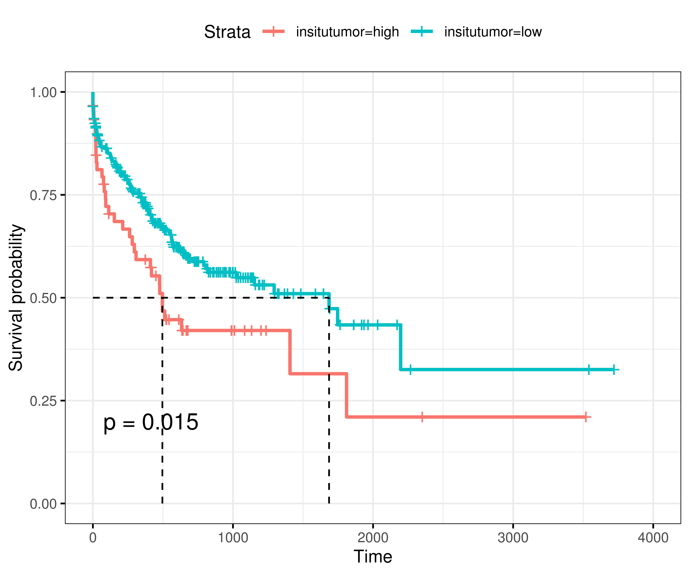

```R
TCGA_STAD_Sel1 <- TCGA_STAD_Sel[,c("insitutumor", "subtumor")]
TCGA_STAD_Sel1$group <- unlist(future_lapply(1:nrow(TCGA_STAD_Sel1),function(x){
    sel_tmp <- TCGA_STAD_Sel1[x,]
    group_n <- colnames(sel_tmp)[which(sel_tmp==max(sel_tmp))]
    return(group_n)
    }))
library("survival")
library("survminer")
All_merge_clinical <- cbind(TCGA_STAD_clinical_sel,TCGA_STAD_Sel1)
meta <- All_merge_clinical
meta[is.na(meta$days_to_last_follow_up),]$days_to_last_follow_up <- "HHH"
tmp <- subset(meta,days_to_last_follow_up=="HHH")
tmp$days_to_last_follow_up <- tmp$days_to_death
no_na <- meta[setdiff(rownames(meta),rownames(tmp)),]
all_merge <- rbind(tmp,no_na)
all_merge <- subset(all_merge,days_to_last_follow_up != "HHH")
all_merge$vital_status <- as.character(all_merge$vital_status)
all_merge$status <- ifelse(all_merge$vital_status=="Alive",0,1)
all_merge$days_to_last_follow_up <- as.numeric(all_merge$days_to_last_follow_up)
library(ggalluvial)
all_merge$Cancer.Metastasis.Stage.Code <- as.character(all_merge$Cancer.Metastasis.Stage.Code)
all_merge1 <- subset(all_merge, Cancer.Metastasis.Stage.Code!="MX")
summar_group <- as.data.frame(table(all_merge1$Cancer.Metastasis.Stage.Code,all_merge1$group))
summar_group <- do.call(rbind,future_lapply(unique(summar_group$Var1),function(x){
  tmp_s <- subset(summar_group,Var1==x)
  tmp_s$normalized_Freq <- round(100*(tmp_s$Freq)/sum(tmp_s$Freq),2)
  return(tmp_s)
  }))
summar_group$Var1 <- factor(summar_group$Var1,levels=c("M0","M1"))
summar_group$Var2 <- factor(summar_group$Var2,levels=c("subtumor","insitutumor"))

ff <- ggplot(summar_group, aes(x = Var1, y = normalized_Freq, fill = Var2, 
    stratum = Var2, alluvium = Var2)) +
geom_stratum() +geom_flow(alpha = 0.5) + theme_classic()+labs(x = '', y = 'Relative Abundance(%)',title="")
ggsave(ff,file="Fig4_The_alluvial_plot_of_Sub_and_Orth_sig.png",width=5,height=5)
```

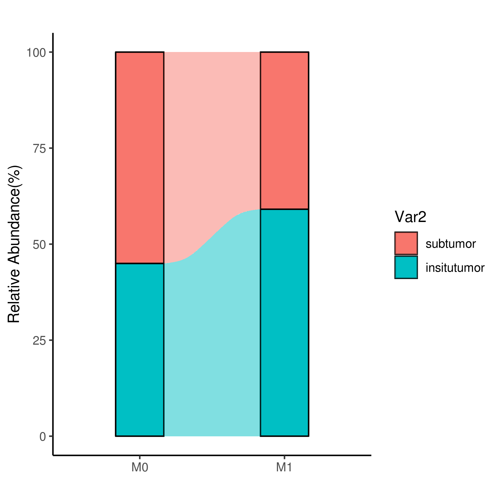


```R
GC_only_Tumor_markers <- mcreadRDS("./GC_only_Tumor_markers.rds",mc.cores=20)
GC_only_Tumor_markers$cluster <- paste0("Clu",as.character(GC_only_Tumor_markers$cluster))
All_top_markers1 <- subset(GC_only_Tumor_markers,p_val_adj < 0.05 & pct.1 > 0.4)
table(All_top_markers1$cluster)
library(iTALK)
library(nichenetr)
library(tidyr)
TCGA_STAD_tmp_ <- future_lapply(1:length(unique(All_top_markers1$cluster)),function(x){
  tmp_clu <- subset(All_top_markers1,cluster==unique(All_top_markers1$cluster)[x])
  tmp_clu = tmp_clu %>% mutate(from = convert_mouse_to_human_symbols(gene)) %>% drop_na()
  TCGA_STAD_tmp <- data.frame(tmp=as.character(apply(TCGA_STAD_t[,intersect(colnames(TCGA_STAD_t),unique(tmp_clu$from))],1,mean)),
    tmp2=as.character(apply(TCGA_STAD_t[,intersect(colnames(TCGA_STAD_t),unique(tmp_clu$from))],1,mean)),
    row.names=rownames(TCGA_STAD_t))
  TCGA_STAD_tmp$tmp <- as.numeric(as.character(scale((as.numeric(as.character(TCGA_STAD_tmp$tmp))))))
# TCGA_STAD_tmp$tmp <- as.numeric(as.character(TCGA_STAD_tmp$tmp))
  colnames(TCGA_STAD_tmp) <- c(unique(All_top_markers1$cluster)[x],"tmp2")
  return(TCGA_STAD_tmp[,1])
  })
TCGA_STAD_tmp <- do.call(cbind,TCGA_STAD_tmp_)
TCGA_STAD_tmp <- as.data.frame(TCGA_STAD_tmp)
colnames(TCGA_STAD_tmp) <- paste0(unique(All_top_markers1$cluster))
rownames(TCGA_STAD_tmp) <- rownames(TCGA_STAD_t)
TCGA_STAD_Sel <- TCGA_STAD_tmp
TCGA_STAD_clinical_sel <- TCGA_STAD_clinical[rownames(TCGA_STAD_Sel),]
All_merge_clinical <- cbind(TCGA_STAD_clinical_sel,TCGA_STAD_Sel)
meta <- All_merge_clinical
meta[is.na(meta$days_to_last_follow_up),]$days_to_last_follow_up <- "HHH"
tmp <- subset(meta,days_to_last_follow_up=="HHH")
tmp$days_to_last_follow_up <- tmp$days_to_death
no_na <- meta[setdiff(rownames(meta),rownames(tmp)),]
all_merge <- rbind(tmp,no_na)
all_merge <- subset(all_merge,days_to_last_follow_up != "HHH")
all_merge$vital_status <- as.character(all_merge$vital_status)
all_merge$status <- ifelse(all_merge$vital_status=="Alive",0,1)
all_merge$days_to_last_follow_up <- as.numeric(all_merge$days_to_last_follow_up)
library("survival")
library("survminer")

all_merge.cut <- surv_cutpoint(
   all_merge,
   time = "days_to_last_follow_up",
   event = "status",
  variables = c("Clu0"),
   progressbar=TRUE,
   minprop=0.3
)
summary(all_merge.cut)
all_merge.cut.cat <- surv_categorize(all_merge.cut) 
library(survival)
fit <- survfit(Surv(days_to_last_follow_up, status) ~ Clu0, data = all_merge.cut.cat)
aa <- ggsurvplot(fit, data = all_merge.cut.cat,
surv.median.line = "hv",
pval = TRUE,
ggtheme = theme_bw(),
risk.table=TRUE)
ggsave("Fig4_Tumor_Clu0_survival.png", plot=aa$plot,width = 6, height = 5,dpi=1080)
```

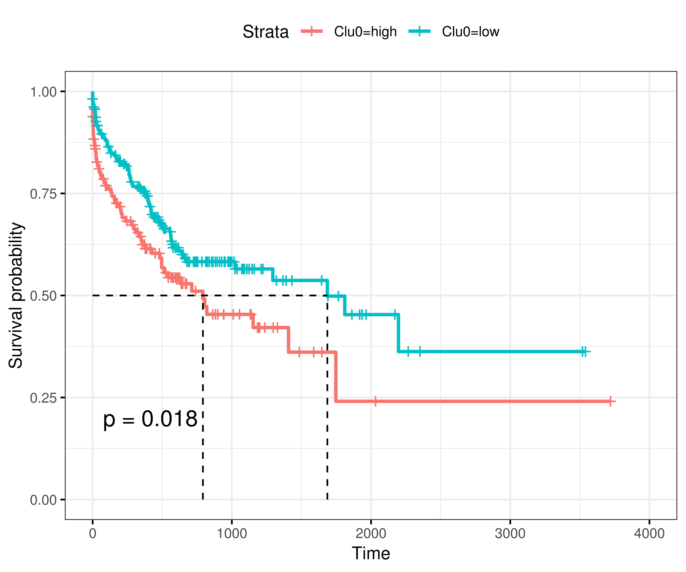


```R
TCGA_STAD_Sel1 <- TCGA_STAD_Sel
TCGA_STAD_Sel1$group <- unlist(future_lapply(1:nrow(TCGA_STAD_Sel1),function(x){
    sel_tmp <- TCGA_STAD_Sel1[x,]
    group_n <- colnames(sel_tmp)[which(sel_tmp==max(sel_tmp))]
    return(group_n)
    }))
library("survival")
library("survminer")
All_merge_clinical <- cbind(TCGA_STAD_clinical_sel,TCGA_STAD_Sel1)
meta <- All_merge_clinical
meta[is.na(meta$days_to_last_follow_up),]$days_to_last_follow_up <- "HHH"
tmp <- subset(meta,days_to_last_follow_up=="HHH")
tmp$days_to_last_follow_up <- tmp$days_to_death
no_na <- meta[setdiff(rownames(meta),rownames(tmp)),]
all_merge <- rbind(tmp,no_na)
all_merge <- subset(all_merge,days_to_last_follow_up != "HHH")
all_merge$vital_status <- as.character(all_merge$vital_status)
all_merge$status <- ifelse(all_merge$vital_status=="Alive",0,1)
all_merge$days_to_last_follow_up <- as.numeric(all_merge$days_to_last_follow_up)

all_merge$Cancer.Metastasis.Stage.Code <- as.character(all_merge$Cancer.Metastasis.Stage.Code)
all_merge1 <- subset(all_merge, Cancer.Metastasis.Stage.Code!="MX")
library(ggalluvial)
summar_group <- as.data.frame(table(all_merge1$Cancer.Metastasis.Stage.Code,all_merge1$group))
summar_group <- do.call(rbind,future_lapply(unique(summar_group$Var1),function(x){
  tmp_s <- subset(summar_group,Var1==x)
  tmp_s$normalized_Freq <- round(100*(tmp_s$Freq)/sum(tmp_s$Freq),2)
  return(tmp_s)
  }))
summar_group$Var1 <- factor(summar_group$Var1,levels=c("M0","M1"))
summar_group$Var2 <- factor(summar_group$Var2,levels=c("Clu0","Clu1"))
aa <- ggplot(summar_group, aes(x = Var1, y = normalized_Freq, fill = Var2, 
    stratum = Var2, alluvium = Var2)) +
geom_stratum() + geom_flow(alpha = 0.5) + theme_classic()+labs(x = '', y = 'Relative Abundance(%)',title="")
ggsave("Fig4_The_alluvial_plot_of_Clu0_Clu1_sig.png", plot=aa,width = 6, height = 5,dpi=1080)
```

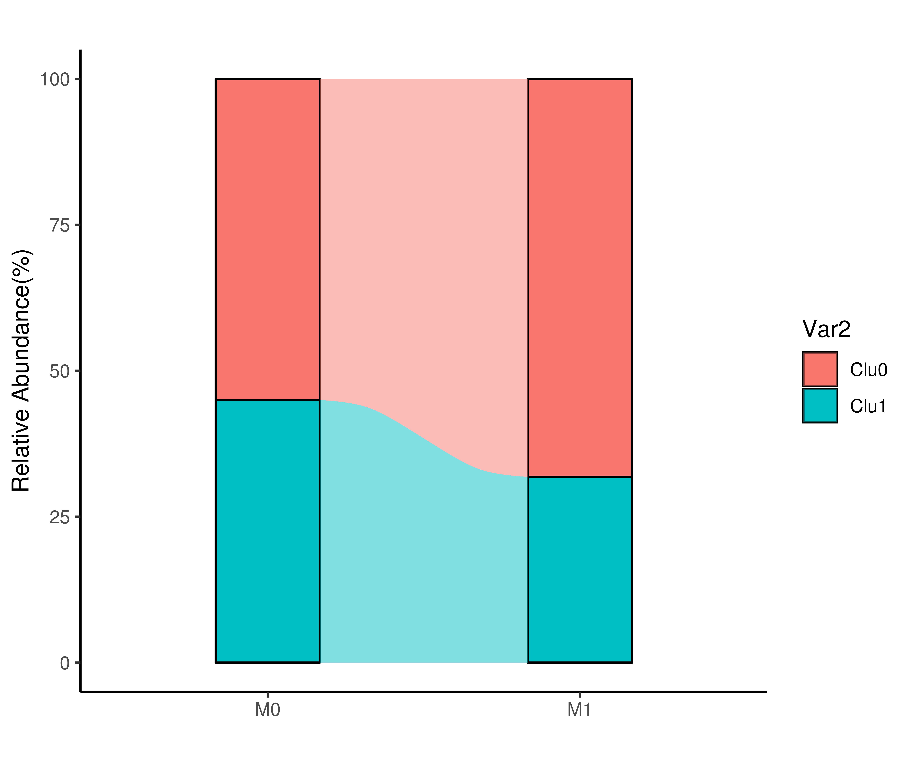

```R
#################macro
#################macro
#################macro
All_DGEs_markers <- subset(All_DGEs,p_val_adj < 0.05 & pct.2 < 0.4 & abs(avg_logFC) > 0)
All_DGEs_markers <- subset(subset(All_DGEs_markers,cluster=="macro"),p_val_adj < 0.05 & pct.2 < 0.3 & pct.1 > 0.1)
print(table(All_DGEs_markers$group))
All_DGEs_markers$X <- as.character(All_DGEs_markers$X)
library(iTALK)
library(nichenetr)
library(tidyr)
library(dplyr)

TCGA_STAD_Sel_ <- future_lapply(1:length(unique(All_DGEs_markers$cluster)),function(x) {
	All_DGEs_markers_tmp <- subset(All_DGEs_markers,cluster==unique(All_DGEs_markers$cluster)[x])
	print(table(All_DGEs_markers_tmp$group))
	TCGA_STAD_tmp_ <- future_lapply(1:length(unique(All_DGEs_markers_tmp$group)),function(x){
	  tmp_clu <- subset(All_DGEs_markers_tmp,group==unique(All_DGEs_markers_tmp$group)[x])
	  tmp_clu = tmp_clu %>% mutate(from = convert_mouse_to_human_symbols(X)) %>% drop_na()
	  TCGA_STAD_tmp <- data.frame(tmp=as.character(apply(TCGA_STAD_t[,intersect(colnames(TCGA_STAD_t),unique(tmp_clu$from))],1,mean)),
	    tmp2=as.character(apply(TCGA_STAD_t[,intersect(colnames(TCGA_STAD_t),unique(tmp_clu$from))],1,mean)),
	    row.names=rownames(TCGA_STAD_t))
	  TCGA_STAD_tmp$tmp <- as.numeric(as.character(scale((as.numeric(as.character(TCGA_STAD_tmp$tmp))))))
	# TCGA_STAD_tmp$tmp <- as.numeric(as.character(TCGA_STAD_tmp$tmp))
	  colnames(TCGA_STAD_tmp) <- c(unique(All_DGEs_markers_tmp$group)[x],"tmp2")
	  return(TCGA_STAD_tmp[,1])
	  })
	TCGA_STAD_tmp <- do.call(cbind,TCGA_STAD_tmp_)
	TCGA_STAD_tmp <- as.data.frame(TCGA_STAD_tmp)
	colnames(TCGA_STAD_tmp) <- paste0(unique(All_DGEs_markers_tmp$group),unique(All_DGEs_markers$cluster)[x])
	rownames(TCGA_STAD_tmp) <- rownames(TCGA_STAD_t)
	TCGA_STAD_tmp <- as.data.frame(t(TCGA_STAD_tmp))
	return(TCGA_STAD_tmp)
	})
TCGA_STAD_Sel <- do.call(rbind,TCGA_STAD_Sel_)
TCGA_STAD_Sel <- as.data.frame(t(TCGA_STAD_Sel))
TCGA_STAD_clinical_sel <- TCGA_STAD_clinical[rownames(TCGA_STAD_Sel),]
All_merge_clinical <- cbind(TCGA_STAD_clinical_sel,TCGA_STAD_Sel)
meta <- All_merge_clinical
meta[is.na(meta$days_to_last_follow_up),]$days_to_last_follow_up <- "HHH"
tmp <- subset(meta,days_to_last_follow_up=="HHH")
tmp$days_to_last_follow_up <- tmp$days_to_death
no_na <- meta[setdiff(rownames(meta),rownames(tmp)),]
all_merge <- rbind(tmp,no_na)
all_merge <- subset(all_merge,days_to_last_follow_up != "HHH")
all_merge$vital_status <- as.character(all_merge$vital_status)
all_merge$status <- ifelse(all_merge$vital_status=="Alive",0,1)
all_merge$days_to_last_follow_up <- as.numeric(all_merge$days_to_last_follow_up)
library("survival")
library("survminer")

all_merge.cut <- surv_cutpoint(
   all_merge,
   time = "days_to_last_follow_up",
   event = "status",
   variables = c("insitumacro"),
   progressbar=TRUE,
   minprop=0.3
)
summary(all_merge.cut)
plot(all_merge.cut, "insitumacro")
all_merge.cut.cat <- surv_categorize(all_merge.cut) 
library(survival)
fit <- survfit(Surv(days_to_last_follow_up, status) ~ insitumacro, data = all_merge.cut.cat)
ggsurvplot(fit, data = all_merge.cut.cat,
surv.median.line = "hv",
pval = TRUE,
ggtheme = theme_bw(),
risk.table=TRUE)
dev.off()
ggsave("FigureS4_macro_Survival_curve.png", plot=aa$plot,width = 6, height = 5,dpi=1080)
```


```R
#################fibro
#################fibro
#################fibro
All_DGEs_markers <- subset(All_DGEs,p_val_adj < 0.05 & pct.2 < 0.4 & abs(avg_logFC) > 0)
All_DGEs_markers <- subset(subset(All_DGEs_markers,cluster=="fibro"),p_val_adj < 0.05 & pct.2 < 0.3 & pct.1 > 0.1)
print(table(All_DGEs_markers$group))
All_DGEs_markers$X <- as.character(All_DGEs_markers$X)
library(iTALK)
library(nichenetr)
library(tidyr)
TCGA_STAD_Sel_ <- future_lapply(1:length(unique(All_DGEs_markers$cluster)),function(x) {
	All_DGEs_markers_tmp <- subset(All_DGEs_markers,cluster==unique(All_DGEs_markers$cluster)[x])
	print(table(All_DGEs_markers_tmp$group))
	TCGA_STAD_tmp_ <- future_lapply(1:length(unique(All_DGEs_markers_tmp$group)),function(x){
	  tmp_clu <- subset(All_DGEs_markers_tmp,group==unique(All_DGEs_markers_tmp$group)[x])
	  tmp_clu = tmp_clu %>% mutate(from = convert_mouse_to_human_symbols(X)) %>% drop_na()
	  TCGA_STAD_tmp <- data.frame(tmp=as.character(apply(TCGA_STAD_t[,intersect(colnames(TCGA_STAD_t),unique(tmp_clu$from))],1,mean)),
	    tmp2=as.character(apply(TCGA_STAD_t[,intersect(colnames(TCGA_STAD_t),unique(tmp_clu$from))],1,mean)),
	    row.names=rownames(TCGA_STAD_t))
	  TCGA_STAD_tmp$tmp <- as.numeric(as.character(scale((as.numeric(as.character(TCGA_STAD_tmp$tmp))))))
	# TCGA_STAD_tmp$tmp <- as.numeric(as.character(TCGA_STAD_tmp$tmp))
	  colnames(TCGA_STAD_tmp) <- c(unique(All_DGEs_markers_tmp$group)[x],"tmp2")
	  return(TCGA_STAD_tmp[,1])
	  })
	TCGA_STAD_tmp <- do.call(cbind,TCGA_STAD_tmp_)
	TCGA_STAD_tmp <- as.data.frame(TCGA_STAD_tmp)
	colnames(TCGA_STAD_tmp) <- paste0(unique(All_DGEs_markers_tmp$group),unique(All_DGEs_markers$cluster)[x])
	rownames(TCGA_STAD_tmp) <- rownames(TCGA_STAD_t)
	TCGA_STAD_tmp <- as.data.frame(t(TCGA_STAD_tmp))
	return(TCGA_STAD_tmp)
	})
TCGA_STAD_Sel <- do.call(rbind,TCGA_STAD_Sel_)
TCGA_STAD_Sel <- as.data.frame(t(TCGA_STAD_Sel))
TCGA_STAD_clinical_sel <- TCGA_STAD_clinical[rownames(TCGA_STAD_Sel),]
All_merge_clinical <- cbind(TCGA_STAD_clinical_sel,TCGA_STAD_Sel)
meta <- All_merge_clinical
meta[is.na(meta$days_to_last_follow_up),]$days_to_last_follow_up <- "HHH"
tmp <- subset(meta,days_to_last_follow_up=="HHH")
tmp$days_to_last_follow_up <- tmp$days_to_death
no_na <- meta[setdiff(rownames(meta),rownames(tmp)),]
all_merge <- rbind(tmp,no_na)
all_merge <- subset(all_merge,days_to_last_follow_up != "HHH")
all_merge$vital_status <- as.character(all_merge$vital_status)
all_merge$status <- ifelse(all_merge$vital_status=="Alive",0,1)
all_merge$days_to_last_follow_up <- as.numeric(all_merge$days_to_last_follow_up)
library("survival")
library("survminer")

all_merge.cut <- surv_cutpoint(
   all_merge,
   time = "days_to_last_follow_up",
   event = "status",
   variables = c("insitufibro"),
   progressbar=TRUE,
   minprop=0.3
)
summary(all_merge.cut)
all_merge.cut.cat <- surv_categorize(all_merge.cut) 
library(survival)
fit <- survfit(Surv(days_to_last_follow_up, status) ~ insitufibro, data = all_merge.cut.cat)
aa <- ggsurvplot(fit, data = all_merge.cut.cat,
surv.median.line = "hv",
pval = TRUE,
ggtheme = theme_bw(),
risk.table=TRUE)
ggsave("FigS4_Fibro_Survival_curve.png",plot=aa$plot,width = 6, height = 5,dpi=1080)
```


```R
#################neutro
#################neutro
#################neutro
All_DGEs_markers <- subset(All_DGEs,p_val_adj < 0.05 & pct.2 < 0.4 & abs(avg_logFC) > 0)
All_DGEs_markers <- subset(subset(All_DGEs_markers,cluster=="neutro"),p_val_adj < 0.05 & pct.2 < 0.3 & pct.1 > 0.1)
print(table(All_DGEs_markers$group))
All_DGEs_markers$X <- as.character(All_DGEs_markers$X)
library(iTALK)
library(nichenetr)
library(tidyr)
TCGA_STAD_Sel_ <- future_lapply(1:length(unique(All_DGEs_markers$cluster)),function(x) {
	All_DGEs_markers_tmp <- subset(All_DGEs_markers,cluster==unique(All_DGEs_markers$cluster)[x])
	print(table(All_DGEs_markers_tmp$group))
	TCGA_STAD_tmp_ <- future_lapply(1:length(unique(All_DGEs_markers_tmp$group)),function(x){
	  tmp_clu <- subset(All_DGEs_markers_tmp,group==unique(All_DGEs_markers_tmp$group)[x])
	  tmp_clu = tmp_clu %>% mutate(from = convert_mouse_to_human_symbols(X)) %>% drop_na()
	  TCGA_STAD_tmp <- data.frame(tmp=as.character(apply(TCGA_STAD_t[,intersect(colnames(TCGA_STAD_t),unique(tmp_clu$from))],1,mean)),
	    tmp2=as.character(apply(TCGA_STAD_t[,intersect(colnames(TCGA_STAD_t),unique(tmp_clu$from))],1,mean)),
	    row.names=rownames(TCGA_STAD_t))
	  TCGA_STAD_tmp$tmp <- as.numeric(as.character(scale((as.numeric(as.character(TCGA_STAD_tmp$tmp))))))
	# TCGA_STAD_tmp$tmp <- as.numeric(as.character(TCGA_STAD_tmp$tmp))
	  colnames(TCGA_STAD_tmp) <- c(unique(All_DGEs_markers_tmp$group)[x],"tmp2")
	  return(TCGA_STAD_tmp[,1])
	  })
	TCGA_STAD_tmp <- do.call(cbind,TCGA_STAD_tmp_)
	TCGA_STAD_tmp <- as.data.frame(TCGA_STAD_tmp)
	colnames(TCGA_STAD_tmp) <- paste0(unique(All_DGEs_markers_tmp$group),unique(All_DGEs_markers$cluster)[x])
	rownames(TCGA_STAD_tmp) <- rownames(TCGA_STAD_t)
	TCGA_STAD_tmp <- as.data.frame(t(TCGA_STAD_tmp))
	return(TCGA_STAD_tmp)
	})
TCGA_STAD_Sel <- do.call(rbind,TCGA_STAD_Sel_)
TCGA_STAD_Sel <- as.data.frame(t(TCGA_STAD_Sel))
TCGA_STAD_clinical_sel <- TCGA_STAD_clinical[rownames(TCGA_STAD_Sel),]
All_merge_clinical <- cbind(TCGA_STAD_clinical_sel,TCGA_STAD_Sel)
meta <- All_merge_clinical
meta[is.na(meta$days_to_last_follow_up),]$days_to_last_follow_up <- "HHH"
tmp <- subset(meta,days_to_last_follow_up=="HHH")
tmp$days_to_last_follow_up <- tmp$days_to_death
no_na <- meta[setdiff(rownames(meta),rownames(tmp)),]
all_merge <- rbind(tmp,no_na)
all_merge <- subset(all_merge,days_to_last_follow_up != "HHH")
all_merge$vital_status <- as.character(all_merge$vital_status)
all_merge$status <- ifelse(all_merge$vital_status=="Alive",0,1)
all_merge$days_to_last_follow_up <- as.numeric(all_merge$days_to_last_follow_up)
library("survival")
library("survminer")

all_merge.cut <- surv_cutpoint(
   all_merge,
   time = "days_to_last_follow_up",
   event = "status",
   variables = c("insituneutro"),
   progressbar=TRUE,
   minprop=0.3
)
summary(all_merge.cut)

all_merge.cut.cat <- surv_categorize(all_merge.cut) 
library(survival)
fit <- survfit(Surv(days_to_last_follow_up, status) ~ insituneutro, data = all_merge.cut.cat)
aa <- ggsurvplot(fit, data = all_merge.cut.cat,
surv.median.line = "hv",
pval = TRUE,
ggtheme = theme_bw(),
risk.table=TRUE)
ggsave("FigureS4_Neutro_Survival_curve.png",plot=aa$plot,width = 6, height = 5,dpi=1080)
```


```R
#################endo
#################endo
#################endo
All_DGEs_markers <- subset(All_DGEs,p_val_adj < 0.05 & pct.2 < 0.4 & abs(avg_logFC) > 0)
All_DGEs_markers <- subset(subset(All_DGEs_markers,cluster=="endo"),p_val_adj < 0.05 & pct.2 < 0.3 & pct.1 > 0.1)
print(table(All_DGEs_markers$group))
All_DGEs_markers$X <- as.character(All_DGEs_markers$X)
library(iTALK)
library(nichenetr)
library(tidyr)
TCGA_STAD_Sel_ <- future_lapply(1:length(unique(All_DGEs_markers$cluster)),function(x) {
	All_DGEs_markers_tmp <- subset(All_DGEs_markers,cluster==unique(All_DGEs_markers$cluster)[x])
	print(table(All_DGEs_markers_tmp$group))
	TCGA_STAD_tmp_ <- future_lapply(1:length(unique(All_DGEs_markers_tmp$group)),function(x){
	  tmp_clu <- subset(All_DGEs_markers_tmp,group==unique(All_DGEs_markers_tmp$group)[x])
	  tmp_clu = tmp_clu %>% mutate(from = convert_mouse_to_human_symbols(X)) %>% drop_na()
	  TCGA_STAD_tmp <- data.frame(tmp=as.character(apply(TCGA_STAD_t[,intersect(colnames(TCGA_STAD_t),unique(tmp_clu$from))],1,mean)),
	    tmp2=as.character(apply(TCGA_STAD_t[,intersect(colnames(TCGA_STAD_t),unique(tmp_clu$from))],1,mean)),
	    row.names=rownames(TCGA_STAD_t))
	  TCGA_STAD_tmp$tmp <- as.numeric(as.character(scale((as.numeric(as.character(TCGA_STAD_tmp$tmp))))))
	# TCGA_STAD_tmp$tmp <- as.numeric(as.character(TCGA_STAD_tmp$tmp))
	  colnames(TCGA_STAD_tmp) <- c(unique(All_DGEs_markers_tmp$group)[x],"tmp2")
	  return(TCGA_STAD_tmp[,1])
	  })
	TCGA_STAD_tmp <- do.call(cbind,TCGA_STAD_tmp_)
	TCGA_STAD_tmp <- as.data.frame(TCGA_STAD_tmp)
	colnames(TCGA_STAD_tmp) <- paste0(unique(All_DGEs_markers_tmp$group),unique(All_DGEs_markers$cluster)[x])
	rownames(TCGA_STAD_tmp) <- rownames(TCGA_STAD_t)
	TCGA_STAD_tmp <- as.data.frame(t(TCGA_STAD_tmp))
	return(TCGA_STAD_tmp)
	})
TCGA_STAD_Sel <- do.call(rbind,TCGA_STAD_Sel_)
TCGA_STAD_Sel <- as.data.frame(t(TCGA_STAD_Sel))
TCGA_STAD_clinical_sel <- TCGA_STAD_clinical[rownames(TCGA_STAD_Sel),]
All_merge_clinical <- cbind(TCGA_STAD_clinical_sel,TCGA_STAD_Sel)
meta <- All_merge_clinical
meta[is.na(meta$days_to_last_follow_up),]$days_to_last_follow_up <- "HHH"
tmp <- subset(meta,days_to_last_follow_up=="HHH")
tmp$days_to_last_follow_up <- tmp$days_to_death
no_na <- meta[setdiff(rownames(meta),rownames(tmp)),]
all_merge <- rbind(tmp,no_na)
all_merge <- subset(all_merge,days_to_last_follow_up != "HHH")
all_merge$vital_status <- as.character(all_merge$vital_status)
all_merge$status <- ifelse(all_merge$vital_status=="Alive",0,1)
all_merge$days_to_last_follow_up <- as.numeric(all_merge$days_to_last_follow_up)
library("survival")
library("survminer")
all_merge.cut <- surv_cutpoint(
   all_merge,
   time = "days_to_last_follow_up",
   event = "status",
   variables = c("insituendo"),
   progressbar=TRUE,
   minprop=0.3
)
summary(all_merge.cut)
all_merge.cut.cat <- surv_categorize(all_merge.cut) 
library(survival)
fit <- survfit(Surv(days_to_last_follow_up, status) ~ insituendo, data = all_merge.cut.cat)
aa <- ggsurvplot(fit, data = all_merge.cut.cat,
surv.median.line = "hv",
pval = TRUE,
ggtheme = theme_bw(),
risk.table=TRUE)
ggsave("FigureS4_Endothelium_Survival_curve.png",plot=aa$plot,width = 6, height = 5,dpi=1080)
```


#### GO enrichment results

```R
library(iTALK)
library(nichenetr)
library(tidyr)
library(Rsamtools)
library(GenomicFeatures)
library(GenomicAlignments)
library(BiocParallel)
library(pheatmap)
library(RColorBrewer)
library(PoiClaClu)
library(DOSE)
library(clusterProfiler)
library(topGO)
library(pathview)
library(org.Hs.eg.db)
library(AnnotationDbi)
library(DOSE)
library(clusterProfiler)
library(ggplot2)
library(org.Mm.eg.db)
library(AnnotationDbi)
library(topGO)
library(clusterProfiler)
library(AnnotationDbi)

DEG_endo <- read.csv("./DEG_endo.csv")
DEG_fibro <- read.csv("./DEG_fibro.csv")
DEG_macro <- read.csv("./DEG_macro.csv")
DEG_neutro <- read.csv("./DEG_neutro.csv")
DEG_tumor <- read.csv("./DEG_tumor.csv")

DEG_macro$group <- ifelse(DEG_macro$avg_logFC>0, "insitu","sub")
DEG_macro$entrez <- mapIds(x = org.Mm.eg.db,
            keys = as.character(DEG_macro$X),
            keytype ="SYMBOL",
            column ="ENTREZID",
            multiVals="first")
macro_DGEs_markers <- subset(DEG_macro,p_val_adj < 0.05)
macro_DGEs_log025 <- subset(macro_DGEs_markers,avg_logFC > 0.25 | avg_logFC < -0.25)
table(macro_DGEs_log025$group)

DEG_endo$group <- ifelse(DEG_endo$avg_logFC>0, "insitu","sub")
DEG_enso$entrez <- mapIds(x = org.Mm.eg.db,
            keys = as.character(DEG_enso$X),
            keytype ="SYMBOL",
            column ="ENTREZID",
            multiVals="first")
endo_DGEs_markers <- subset(DEG_endo,p_val_adj < 0.05)
endo_DGEs_log025 <- subset(endo_DGEs_markers,avg_logFC > 0.25 | avg_logFC < -0.25)
table(endo_DGEs_log025$group)

DEG_neutro$group <- ifelse(DEG_neutro$avg_logFC>0, "insitu","sub")
DEG_neutro$entrez <- mapIds(x = org.Mm.eg.db,
            keys = as.character(DEG_neutro$X),
            keytype ="SYMBOL",
            column ="ENTREZID",
            multiVals="first")
neutro_DGEs_markers <- subset(DEG_neutro,p_val_adj < 0.05)
neutro_DGEs_log025 <- subset(neutro_DGEs_markers,avg_logFC > 0.25 | avg_logFC < -0.25)
table(neutro_DGEs_log025$group)

DEG_tumor$group <- ifelse(DEG_tumor$avg_logFC>0, "insitu","sub")
DEG_tumor$entrez <- mapIds(x = org.Mm.eg.db,
            keys = as.character(DEG_tumor$X),
            keytype ="SYMBOL",
            column ="ENTREZID",
            multiVals="first")
tumor_DGEs_markers <- subset(DEG_tumor,p_val_adj < 0.05)
tumor_DGEs_log025 <- subset(tumor_DGEs_markers,avg_logFC > 0.25 | avg_logFC < -0.25)
table(tumor_DGEs_log025$group)

DEG_fibro$group <- ifelse(DEG_fibro$avg_logFC>0, "insitu","sub")
DEG_fibro$entrez <- mapIds(x = org.Mm.eg.db,
            keys = as.character(DEG_fibro$X),
            keytype ="SYMBOL",
            column ="ENTREZID",
            multiVals="first")
fibro_DGEs_markers <- subset(DEG_fibro,p_val_adj < 0.05)
fibro_DGEs_log025 <- subset(fibro_DGEs_markers,avg_logFC > 0.25 | avg_logFC < -0.25)
table(fibro_DGEs_log025$group)

macro_DGEs_list <- macro_DGEs_log025[,c("entrez","avg_logFC","group")]
macro_DGEs_list <- na.omit(macro_DGEs_list)
macro_enrichGO_BP <- compareCluster(entrez~group, data=macro_DGEs_list, fun="enrichGO",OrgDb=org.Mm.eg.db,readable=T,ont = "BP")
head(as.data.frame(macro_enrichGO_BP))

fibro_DGEs_list <- fibro_DGEs_log025[,c("entrez","avg_logFC","group")]
fibro_DGEs_list <- na.omit(fibro_DGEs_list)
fibro_enrichGO_BP <- compareCluster(entrez~group, data=fibro_DGEs_list, fun="enrichGO",OrgDb=org.Mm.eg.db,readable=T,ont = "BP")
head(as.data.frame(fibro_enrichGO_BP))

neutro_DGEs_list <- neutro_DGEs_log025[,c("entrez","avg_logFC","group")]
neutro_DGEs_list <- na.omit(neutro_DGEs_list)
neutro_enrichGO_BP <- compareCluster(entrez~group, data=neutro_DGEs_list, fun="enrichGO",OrgDb=org.Mm.eg.db,readable=T,ont = "BP")
head(as.data.frame(neutro_enrichGO_BP))

tumor_DGEs_list <- tumor_DGEs_log025[,c("entrez","avg_logFC","group")]
tumor_DGEs_list <- na.omit(tumor_DGEs_list)
tumor_enrichGO_BP <- compareCluster(entrez~group, data=tumor_DGEs_list, fun="enrichGO",OrgDb=org.Mm.eg.db,readable=T,ont = "BP")
head(as.data.frame(tumor_enrichGO_BP))

endo_DGEs_list <- endo_DGEs_log025[,c("entrez","avg_logFC","group")]
endo_DGEs_list <- na.omit(endo_DGEs_list)
endo_enrichGO_BP <- compareCluster(entrez~group, data=endo_DGEs_list, fun="enrichGO",OrgDb=org.Mm.eg.db,readable=T,ont = "BP")
head(as.data.frame(endo_enrichGO_BP))
```

```R
fibro_GO_BP <- read.csv("./fibro_GO_BP.csv")
fibro_GO_BP <- fibro_GO_BP[,-1]
fibro_enrichGO_BP@compareClusterResult <- fibro_GO_BP
ff <- dotplot(fibro_enrichGO_BP,showCategory=10,includeAll=FALSE) + theme(axis.text.x  = element_text(angle=45, vjust=1,size=5,hjust = 1)) + labs(title = "DO")
ggsave(ff,file="FigS4_fibro_enrichGO_BP.png", width = 6,height =4,dpi=1080)
```

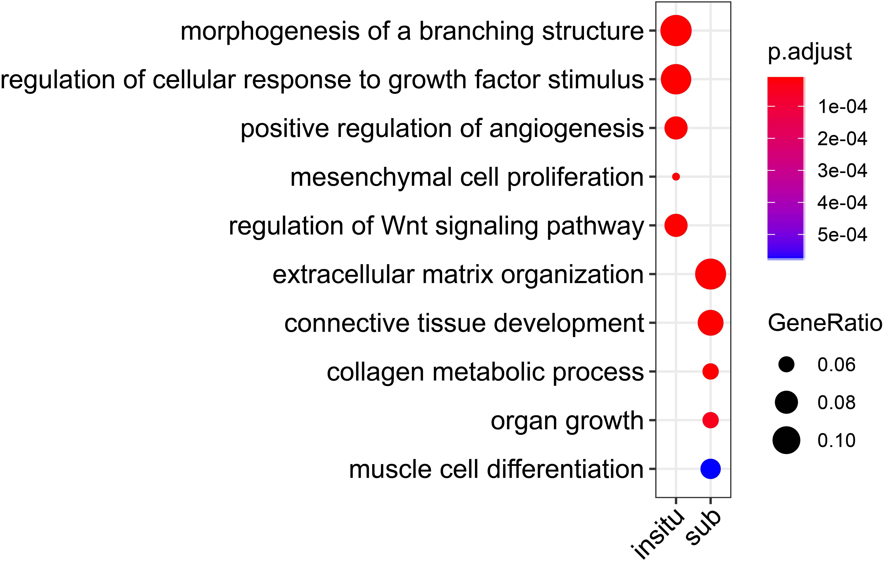

```R
neutro_GO_BP <- read.csv("./neutro_GO_BP.csv")
neutro_GO_BP <- neutro_GO_BP[,-1]
neutro_enrichGO_BP@compareClusterResult <- neutro_GO_BP
ff <- dotplot(neutro_enrichGO_BP,showCategory=10,includeAll=FALSE) + theme(axis.text.x  = element_text(angle=45, vjust=1,size=5,hjust = 1)) + labs(title = "DO")
ggsave(ff,file="FigS4_neutro_enrichGO_BP.svg",width = 6,height =4,dpi=1080)
```

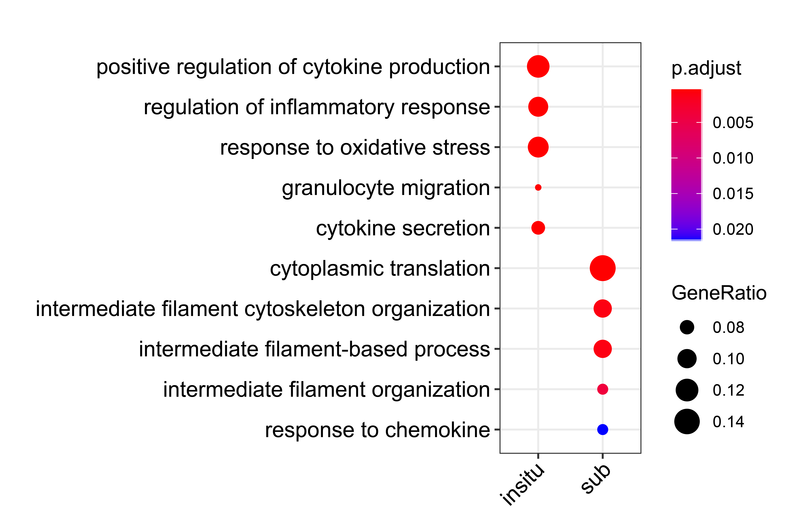

```R
endo_GO_BP <- read.csv("./endo_GO_BP.csv")
endo_GO_BP <- select_endo_GO_BP[,-1]
endo_enrichGO_BP@compareClusterResult <- endo_GO_BP
ff <- dotplot(endo_enrichGO_BP,showCategory=10,includeAll=FALSE) + theme(axis.text.x  = element_text(angle=45, vjust=1,size=5,hjust = 1)) + labs(title = "DO")
ggsave(ff,file="FigS4_endo_enrichGO_BP.png",width = 6,height =4,dpi=1080)
```

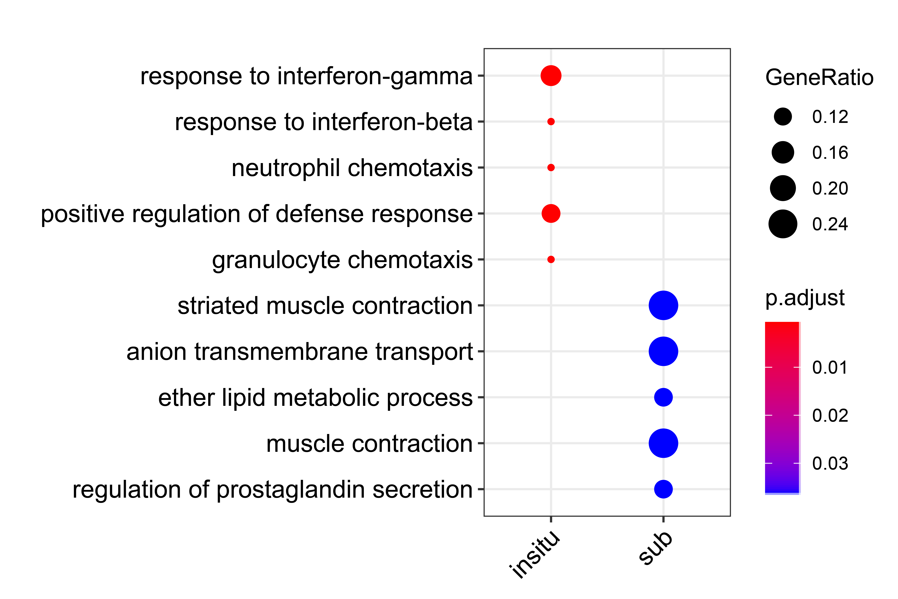

```R
macro_GO_BP <- read.csv("./macrophage_GO_BP.csv")
macro_GO_BP <- macro_GO_BP[,-1]
macro_enrichGO_BP@compareClusterResult <- macro_GO_BP
ff <- dotplot(macro_enrichGO_BP,showCategory=10,includeAll=FALSE) + theme(axis.text.x  = element_text(angle=45, vjust=1,size=5,hjust = 1)) + labs(title = "DO")
ggsave(ff,file="FigS3L_macro_enrichGO_BP.png",width = 9,height =4,dpi=1080)
```

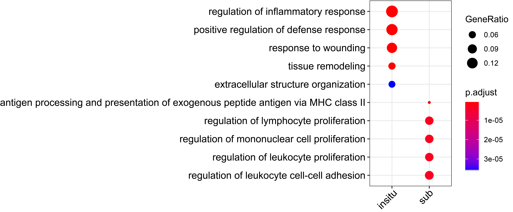

#### GSVA analyses of tumor cells

```R
library(Seurat)
library(GSEABase)
library(Biobase)
library(genefilter)
library(limma)
library(RColorBrewer)
library(GSVA)
library(dplyr)
library(nichenetr)
library(Seurat)
library(MuSiC)
library(trqwe)
library(tidyverse)
library(pheatmap)
library(dplyr)
##Geneset
h_geneSets <- getGmt("./h.all.v7.1.symbols.gmt")
c5_geneSets <- getGmt("./c5.all.v7.1.symbols.gmt")
c2_geneSets <- getGmt("./c2.all.v7.1.symbols.gmt")

Tumor_data <- readRDS("./Orth_and_Sub_Tumor_cells.rds")
Idents(Tumor_data) <- Tumor_data$orig.ident
in_situ_all <- subset(Tumor_data,orig.ident=="in_situ")
sub_all <- subset(Tumor_data,orig.ident=="sub")
insitu_pseudobulk50 <- pseudo_bulk_seurat_mean(seurat_obj=in_situ_all,num_split=50,seed.use=1,slot="data",prefix="insitu_macro")
sub_pseudobulk50 <- pseudo_bulk_seurat_mean(seurat_obj=sub_all,num_split=50,seed.use=1,slot="data",prefix="sub_macro")
all_pseudobulk <- cbind(insitu_pseudobulk50,sub_pseudobulk50)

##convert_mouse_to_human_symbols
all_pseudobulk <- data.frame(all_pseudobulk)
aa <- all_pseudobulk %>% rownames() %>% convert_mouse_to_human_symbols()
all_pseudobulk$symbol <- as.character(aa)
matrix <- all_pseudobulk[!duplicated(all_pseudobulk$symbol),]
matrix <- na.omit(matrix)
rownames(matrix) <- matrix$symbol
matrix <- matrix[,-101]
##run_GSVA
matrix <- as.matrix(matrix)
h_GSVA_res <- gsva(matrix, h_geneSets, min.sz=10, max.sz=500, verbose=FALSE, parallel.sz=10)
c2_GSVA_res <- gsva(matrix, c2_geneSets, min.sz=10, max.sz=500, verbose=FALSE, parallel.sz=10)
c5_GSVA_res <- gsva(matrix, c5_geneSets, min.sz=10, max.sz=500, verbose=FALSE, parallel.sz=10)
sudobulk_GSVA_score <- rbind(h_GSVA_res,c2_GSVA_res,c5_GSVA_res)

annotation1 <- data.frame(c(1:50))
annotation1$group <- "in_situ_macro"
names(annotation1) <- c("order","group")
annotation2 <- data.frame(c(51:100))
annotation2$group <- "sub_macro"
names(annotation2) <- c("order","group")
annotation <- rbind(annotation1,annotation2)
##set_group
group <-as.factor(annotation$group)
design <- model.matrix(~ group + 0)
rownames(design)<-colnames(matrix)
head(design)
contrasts <- makeContrasts(clu1=groupin_situ_macro-groupsub_macro,levels=design)

fiT <- lmFit(h_GSVA_res, design)
fiT2 <- contrasts.fit(fiT, contrasts)
h_fiT3 <- eBayes(fiT2)
fiT <- lmFit(c2_GSVA_res, design)
fiT2 <- contrasts.fit(fiT, contrasts)
c2_fiT3 <- eBayes(fiT2)
fiT <- lmFit(c5_GSVA_res, design)
fiT2 <- contrasts.fit(fiT, contrasts)
c5_fiT3 <- eBayes(fiT2)

#ANNOVA
GSVA_h <- topTable(h_fiT3, number=1000,p.value=0.05, adjust="BH")
GSVA_c2 <- topTable(c2_fiT3, number=1000,p.value=0.05, adjust="BH")
GSVA_c5 <- topTable(c5_fiT3, number=1000,p.value=0.05, adjust="BH")
GSVA_c2c5h <- rbind(GSVA_h,GSVA_c2,GSVA_c5)

library(pheatmap)
library(dplyr)
sudobulk_GSVA_score <- data.frame(sudobulk_GSVA_score)
sudobulk_GSVA_score <- sudobulk_GSVA_score[c("GO_INTEGRIN_BINDING","GO_INTEGRIN_MEDIATED_SIGNALING_PATHWAY","REACTOME_CELL_EXTRACELLULAR_MATRIX_INTERACTIONS","GO_POSITIVE_REGULATION_OF_PODOSOME_ASSEMBLY","PID_FGF_PATHWAY","HALLMARK_NOTCH_SIGNALING","REACTOME_WNT5A_DEPENDENT_INTERNALIZATION_OF_FZD2_FZD5_AND_ROR2","HALLMARK_EPITHELIAL_MESENCHYMAL_TRANSITION","HALLMARK_TGF_BETA_SIGNALING","GO_POSITIVE_REGULATION_OF_SMAD_PROTEIN_SIGNAL_TRANSDUCTION","GILMORE_CORE_NFKB_PATHWAY","GO_POSITIVE_REGULATION_OF_INFLAMMATORY_RESPONSE_TO_ANTIGENIC_STIMULUS","HALLMARK_INFLAMMATORY_RESPONSE","GO_LEUKOCYTE_ACTIVATION_INVOLVED_IN_INFLAMMATORY_RESPONSE","HALLMARK_PROTEIN_SECRETION"),]
range(sudobulk_GSVA_score)
sudobulk_GSVA_score[sudobulk_GSVA_score > 0.4] <- 0.4
sudobulk_GSVA_score[sudobulk_GSVA_score < -0.4] <- -0.4
pdf("FigS3D_TumorCells_psudobulk_GSVA_heatmap.pdf",width=12,height=4)
pheatmap(sudobulk_GSVA_score,clustering_method="ward.D2",
	color = colorRampPalette(c("#2971B1","#6AACD0","#C1DDEB","#F7F7F7","#FACDB5","#E58267","#BB2933"))(50),
	fontsize_row=12,show_rownames=TRUE,show_colnames=FALSE,cluster_row = FALSE,cluster_col= FALSE,border=TRUE)
dev.off()
```


### Part 3. Cell cell interaction analyses

#### Differential expression ligand and receptor gene analyses

```R

all_checkpoint.csv <- list.files("./DEG_checkpoint",pattern="_checkpoint.csv")
All_files_ <- lapply(1:length(all_checkpoint.csv),function(x){
 sel_d <- all_checkpoint.csv[x]
 tmp <- read.csv(paste0("./DEG_checkpoint/",sel_d))
 return(tmp)
 })
All_files <- do.call(rbind,All_files_)
All_files <- subset(All_files,abs(cell_from_logFC) >= 0.1)
All_files$group_Ligand <- ifelse(All_files$cell_from_logFC>0,"Ligand_insitu","Ligand_sub")
sig_Ligand_checkpoint <- subset(All_files,cell_from_q.value <0.05)

all_cytokine.csv <- list.files("./DEG_cytokine",pattern="_cytokine.csv")
All_files_ <- lapply(1:length(all_cytokine.csv),function(x){
 sel_d <- all_cytokine.csv[x]
 tmp <- read.csv(paste0("./DEG_cytokine/",sel_d))
 return(tmp)
 })
All_files <- do.call(rbind,All_files_)
All_files <- subset(All_files,abs(cell_from_logFC) >= 0.1)
All_files$group_Ligand <- ifelse(All_files$cell_from_logFC>0,"Ligand_insitu","Ligand_sub")
sig_Ligand_cytokine <- subset(All_files,cell_from_q.value <0.05)


all_other.csv <- list.files("./DEG_other",pattern="_other.csv")
All_files_ <- lapply(1:length(all_other.csv),function(x){
 sel_d <- all_other.csv[x]
 tmp <- read.csv(paste0("./DEG_other/",sel_d))
 return(tmp)
 })
All_files <- do.call(rbind,All_files_)
All_files <- subset(All_files,abs(cell_from_logFC) >= 0.1)
All_files$group_Ligand <- ifelse(All_files$cell_from_logFC>0,"Ligand_insitu","Ligand_sub")
sig_Ligand_other <- subset(All_files,cell_from_q.value <0.05)


all_growthfactor.csv <- list.files("./DEG_growthfactor",pattern="_growthfactor.csv")
All_files_ <- lapply(1:length(all_growthfactor.csv),function(x){
 sel_d <- all_growthfactor.csv[x]
 tmp <- read.csv(paste0("./DEG_growthfactor/",sel_d))
 return(tmp)
 })
All_files <- do.call(rbind,All_files_)
All_files <- subset(All_files,abs(cell_from_logFC) >= 0.1)
All_files$group_Ligand <- ifelse(All_files$cell_from_logFC>0,"Ligand_insitu","Ligand_sub")
sig_Ligand_growthfactor <- subset(All_files,cell_from_q.value <0.05)


sig_Ligand_checkpoint$ID <- paste(sig_Ligand_checkpoint$cell_from,"_",sig_Ligand_checkpoint$ligand,sep="")
sig_Ligand_cytokine$ID <- paste(sig_Ligand_cytokine$cell_from,"_",sig_Ligand_cytokine$ligand,sep="")
sig_Ligand_growthfactor$ID <- paste(sig_Ligand_growthfactor$cell_from,"_",sig_Ligand_growthfactor$ligand,sep="")
sig_Ligand_other$ID <- paste(sig_Ligand_other$cell_from,"_",sig_Ligand_other$ligand,sep="")

sig_Ligand_checkpoint$ID_1 <- paste(sig_Ligand_checkpoint$group_Ligand,"_",sig_Ligand_checkpoint$ID,sep="")
sig_Ligand_cytokine$ID_1 <- paste(sig_Ligand_cytokine$group_Ligand,"_",sig_Ligand_cytokine$ID,sep="")
sig_Ligand_growthfactor$ID_1 <- paste(sig_Ligand_growthfactor$group_Ligand,"_",sig_Ligand_growthfactor$ID,sep="")
sig_Ligand_other$ID_1 <- paste(sig_Ligand_other$group_Ligand,"_",sig_Ligand_other$ID,sep="")


#for tables
#sig_Ligand_checkpoint <- sig_Ligand_checkpoint[!duplicated(sig_Ligand_checkpoint$ID_1),]
#sig_Ligand_cytokine <- sig_Ligand_cytokine[!duplicated(sig_Ligand_cytokine$ID_1),]
#sig_Ligand_growthfactor <- sig_Ligand_growthfactor[!duplicated(sig_Ligand_growthfactor$ID_1),]
#sig_Ligand_other <- sig_Ligand_other[!duplicated(sig_Ligand_other$ID_1),]
#sig_all_Ligand <- rbind(sig_Ligand_checkpoint,sig_Ligand_cytokine,sig_Ligand_growthfactor,sig_Ligand_other)
#write.csv(sig_all_Ligand,"sig_all_Ligand_for_tables.csv")


tmp_checkpoint <- sig_Ligand_checkpoint[,c("cell_from","group_Ligand","ID_1")]
tmp_checkpoint <- tmp_checkpoint[!duplicated(tmp_checkpoint$ID_1),]

tmp_cytokine <- sig_Ligand_cytokine[,c("cell_from","group_Ligand","ID_1")]
tmp_cytokine <- tmp_cytokine[!duplicated(tmp_cytokine$ID_1),]

tmp_growthfactor <- sig_Ligand_growthfactor[,c("cell_from","group_Ligand","ID_1")]
tmp_growthfactor <- tmp_growthfactor[!duplicated(tmp_growthfactor$ID_1),]

tmp_other <- sig_Ligand_other[,c("cell_from","group_Ligand","ID_1")]
tmp_other <- tmp_other[!duplicated(tmp_other$ID_1),]


tmp_checkpoint$ID_2 <- paste(tmp_checkpoint$group_Ligand,"_",tmp_checkpoint$cell_from,sep="")
tmp_cytokine$ID_2 <- paste(tmp_cytokine$group_Ligand,"_",tmp_cytokine$cell_from,sep="")
tmp_growthfactor$ID_2 <- paste(tmp_growthfactor$group_Ligand,"_",tmp_growthfactor$cell_from,sep="")
tmp_other$ID_2 <- paste(tmp_other$group_Ligand,"_",tmp_other$cell_from,sep="")
tmp_checkpoint <- tmp_checkpoint[,c("cell_from","group_Ligand","ID_1","ID_2")]
tmp_checkpoint <- tmp_checkpoint[!duplicated(tmp_checkpoint$ID_1),]
tmp_cytokine <- tmp_cytokine[,c("cell_from","group_Ligand","ID_1","ID_2")]
tmp_cytokine <- tmp_cytokine[!duplicated(tmp_cytokine$ID_1),]
tmp_growthfactor <- tmp_growthfactor[,c("cell_from","group_Ligand","ID_1","ID_2")]
tmp_growthfactor <- tmp_growthfactor[!duplicated(tmp_growthfactor$ID_1),]
tmp_other <- tmp_other[,c("cell_from","group_Ligand","ID_1","ID_2")]
tmp_other <- tmp_other[!duplicated(tmp_other$ID_1),]

table(tmp_checkpoint$group_Ligand)
table(tmp_cytokine$group_Ligand)
table(tmp_growthfactor$group_Ligand)
table(tmp_other$group_Ligand)

tmp_checkpoint$Type <- "checkpoint"
tmp_cytokine$Type <- "cytokine"
tmp_growthfactor$Type <- "growthfactor"
tmp_other$Type <- "other"

all_Ligand <- rbind(tmp_checkpoint,tmp_cytokine,tmp_growthfactor,tmp_other)

macro <- subset(all_Ligand,cell_from=="macro")
macro$ID_3 <- paste(macro$group_Ligand,"_",macro$Type,sep="")
macro_tmp <- data.frame(table(macro$ID_3))
macro_tmp$Var1 <- factor(macro_tmp$Var1,levels=c("Ligand_sub_checkpoint","Ligand_insitu_checkpoint","Ligand_sub_cytokine","Ligand_insitu_cytokine","Ligand_sub_growthfactor","Ligand_insitu_growthfactor","Ligand_sub_other","Ligand_insitu_other"))
rownames(macro_tmp) <- macro_tmp$Var1

macro_tmp <- macro_tmp[c("Ligand_sub_checkpoint","Ligand_insitu_checkpoint","Ligand_sub_cytokine","Ligand_insitu_cytokine","Ligand_sub_growthfactor","Ligand_insitu_growthfactor","Ligand_sub_other","Ligand_insitu_other"),]
macro_tmp$group <- c("sub","insitu","sub","insitu","sub","insitu","sub","insitu")
macro_tmp$type <- c("checkpoint","checkpoint","cytokine","cytokine","growthfactor","growthfactor","other","other")
macro_tmp$group <- factor(macro_tmp$group,levels=c("sub","insitu"))


endo <- subset(all_Ligand,cell_from=="endo")
endo$ID_3 <- paste(endo$group_Ligand,"_",endo$Type,sep="")
endo_tmp <- data.frame(table(endo$ID_3))
endo_tmp$Var1 <- factor(endo_tmp$Var1,levels=c("Ligand_sub_checkpoint","Ligand_insitu_checkpoint","Ligand_sub_cytokine","Ligand_insitu_cytokine","Ligand_sub_growthfactor","Ligand_insitu_growthfactor","Ligand_sub_other","Ligand_insitu_other"))
rownames(endo_tmp) <- endo_tmp$Var1
endo_tmp <- endo_tmp[c("Ligand_sub_checkpoint","Ligand_insitu_checkpoint","Ligand_sub_cytokine","Ligand_insitu_cytokine","Ligand_sub_growthfactor","Ligand_insitu_growthfactor","Ligand_sub_other","Ligand_insitu_other"),]
endo_tmp$group <- c("sub","insitu","sub","insitu","sub","insitu","sub","insitu")
endo_tmp$type <- c("checkpoint","checkpoint","cytokine","cytokine","growthfactor","growthfactor","other","other")
endo_tmp$group <- factor(endo_tmp$group,levels=c("sub","insitu"))


neutro <- subset(all_Ligand,cell_from=="neutro")
neutro$ID_3 <- paste(neutro$group_Ligand,"_",neutro$Type,sep="")
neutro_tmp <- data.frame(table(neutro$ID_3))
neutro_tmp$Var1 <- factor(neutro_tmp$Var1,levels=c("Ligand_sub_checkpoint","Ligand_insitu_checkpoint","Ligand_sub_cytokine","Ligand_insitu_cytokine","Ligand_sub_growthfactor","Ligand_insitu_growthfactor","Ligand_sub_other","Ligand_insitu_other"))
rownames(neutro_tmp) <- neutro_tmp$Var1
neutro_tmp <- neutro_tmp[c("Ligand_sub_checkpoint","Ligand_insitu_checkpoint","Ligand_sub_cytokine","Ligand_insitu_cytokine","Ligand_sub_growthfactor","Ligand_insitu_growthfactor","Ligand_sub_other","Ligand_insitu_other"),]
neutro_tmp$group <- c("sub","insitu","sub","insitu","sub","insitu","sub","insitu")
neutro_tmp$type <- c("checkpoint","checkpoint","cytokine","cytokine","growthfactor","growthfactor","other","other")
neutro_tmp$group <- factor(neutro_tmp$group,levels=c("sub","insitu"))

tumor <- subset(all_Ligand,cell_from=="tumor")
tumor$ID_3 <- paste(tumor$group_Ligand,"_",tumor$Type,sep="")
tumor_tmp <- data.frame(table(tumor$ID_3))
tumor_tmp$Var1 <- factor(tumor_tmp$Var1,levels=c("Ligand_sub_checkpoint","Ligand_insitu_checkpoint","Ligand_sub_cytokine","Ligand_insitu_cytokine","Ligand_sub_growthfactor","Ligand_insitu_growthfactor","Ligand_sub_other","Ligand_insitu_other"))
rownames(tumor_tmp) <- tumor_tmp$Var1
tumor_tmp <- tumor_tmp[c("Ligand_sub_checkpoint","Ligand_insitu_checkpoint","Ligand_sub_cytokine","Ligand_insitu_cytokine","Ligand_sub_growthfactor","Ligand_insitu_growthfactor","Ligand_sub_other","Ligand_insitu_other"),]
tumor_tmp$group <- c("sub","insitu","sub","insitu","sub","insitu","sub","insitu")
tumor_tmp$type <- c("checkpoint","checkpoint","cytokine","cytokine","growthfactor","growthfactor","other","other")
tumor_tmp$group <- factor(tumor_tmp$group,levels=c("sub","insitu"))


fibro <- subset(all_Ligand,cell_from=="fibro")
fibro$ID_3 <- paste(fibro$group_Ligand,"_",fibro$Type,sep="")
fibro_tmp <- data.frame(table(fibro$ID_3))
fibro_tmp$Var1 <- factor(fibro_tmp$Var1,levels=c("Ligand_sub_checkpoint","Ligand_insitu_checkpoint","Ligand_sub_cytokine","Ligand_insitu_cytokine","Ligand_sub_growthfactor","Ligand_insitu_growthfactor","Ligand_sub_other","Ligand_insitu_other"))
rownames(fibro_tmp) <- fibro_tmp$Var1
fibro_tmp <- fibro_tmp[c("Ligand_sub_checkpoint","Ligand_insitu_checkpoint","Ligand_sub_cytokine","Ligand_insitu_cytokine","Ligand_sub_growthfactor","Ligand_insitu_growthfactor","Ligand_sub_other","Ligand_insitu_other"),]
fibro_tmp$group <- c("sub","insitu","sub","insitu","sub","insitu","sub","insitu")
fibro_tmp$type <- c("checkpoint","checkpoint","cytokine","cytokine","growthfactor","growthfactor","other","other")
fibro_tmp$group <- factor(fibro_tmp$group,levels=c("sub","insitu"))

ff1 <- ggplot(macro_tmp, aes( x = group,y=Freq,fill = type))+
  geom_col(position = 'stack', width = 0.6)+
  theme_bw()+labs(title = "macro_ligands")+
  scale_fill_manual(values=c("#f4a582","#92c5de","#0571b0","#ca0020"))+ 
  scale_y_continuous(expand = c(0,0))+ylim(0,80)
ff2 <- ggplot(endo_tmp, aes( x = group,y=Freq,fill = type))+
  geom_col(position = 'stack', width = 0.6)+
  theme_bw()+labs(title = "endo_ligands")+
  scale_fill_manual(values=c("#f4a582","#92c5de","#0571b0","#ca0020"))+ 
  scale_y_continuous(expand = c(0,0))+ylim(0,80)
ff3 <- ggplot(neutro_tmp, aes( x = group,y=Freq,fill = type))+
  geom_col(position = 'stack', width = 0.6)+
  theme_bw()+labs(title = "neutro_ligands")+
  scale_fill_manual(values=c("#f4a582","#92c5de","#0571b0","#ca0020"))+ 
  scale_y_continuous(expand = c(0,0))+ylim(0,80)
ff4 <- ggplot(tumor_tmp, aes( x = group,y=Freq,fill = type))+
  geom_col(position = 'stack', width = 0.6)+
  theme_bw()+labs(title = "tumor_ligands")+
  scale_fill_manual(values=c("#f4a582","#92c5de","#0571b0","#ca0020"))+
  scale_y_continuous(expand = c(0,0))+ylim(0,80)
ff5 <- ggplot(fibro_tmp, aes( x = group,y=Freq,fill = type))+
  geom_col(position = 'stack', width = 0.6)+
  theme_bw()+labs(title = "fibro_ligands")+
  scale_fill_manual(values=c("#f4a582","#92c5de","#0571b0","#ca0020"))+ 
  scale_y_continuous(expand = c(0,0))+ylim(0,80)
ff <- ff1+ff2+ff3+ff4+ff5
ggsave(ff,file="Fig5_Diff_Ligands.png",width=9,height=5)
```

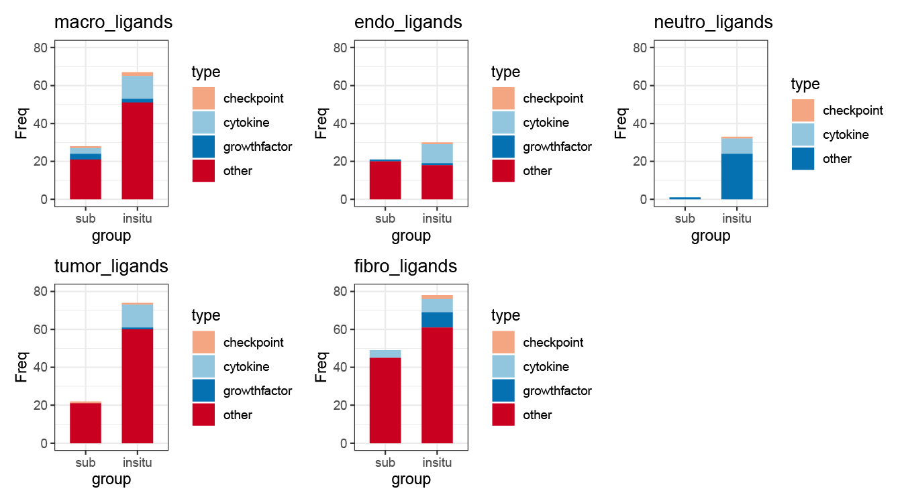

```R
all_checkpoint.csv <- list.files("./DEG_checkpoint",pattern="_checkpoint.csv")
All_files_ <- lapply(1:length(all_checkpoint.csv),function(x){
 sel_d <- all_checkpoint.csv[x]
 tmp <- read.csv(paste0("./DEG_checkpoint/",sel_d))
 return(tmp)
 })
All_files <- do.call(rbind,All_files_)
All_files <- subset(All_files,abs(cell_to_logFC) >= 0.1)
All_files$group_Receptor <- ifelse(All_files$cell_to_logFC>0,"Receptor_insitu","Receptor_sub")
p005_tmp_checkpoint <- subset(All_files,cell_to_q.value <0.05)

all_cytokine.csv <- list.files("./DEG_cytokine",pattern="_cytokine.csv")
All_files_ <- lapply(1:length(all_cytokine.csv),function(x){
 sel_d <- all_cytokine.csv[x]
 tmp <- read.csv(paste0("./DEG_cytokine/",sel_d))
 return(tmp)
 })
All_files <- do.call(rbind,All_files_)
All_files <- subset(All_files,abs(cell_to_logFC) >= 0.1)
All_files$group_Receptor <- ifelse(All_files$cell_to_logFC>0,"Receptor_insitu","Receptor_sub")
p005_tmp_cytokine <- subset(All_files,cell_to_q.value <0.05)

all_growthfactor.csv <- list.files("./DEG_growthfactor",pattern="_growthfactor.csv")
All_files_ <- lapply(1:length(all_growthfactor.csv),function(x){
 sel_d <- all_growthfactor.csv[x]
 tmp <- read.csv(paste0("./DEG_growthfactor/",sel_d))
 return(tmp)
 })
All_files <- do.call(rbind,All_files_)
All_files <- subset(All_files,abs(cell_to_logFC) >= 0.1)
All_files$group_Receptor <- ifelse(All_files$cell_to_logFC>0,"Receptor_insitu","Receptor_sub")
p005_tmp_growthfactor <- subset(All_files,cell_to_q.value <0.05)

all_other.csv <- list.files("./DEG_other",pattern="_other.csv")
All_files_ <- lapply(1:length(all_other.csv),function(x){
 sel_d <- all_other.csv[x]
 tmp <- read.csv(paste0("./DEG_other/",sel_d))
 return(tmp)
 })
All_files <- do.call(rbind,All_files_)
All_files <- subset(All_files,abs(cell_to_logFC) >= 0.1)
All_files$group_Receptor <- ifelse(All_files$cell_to_logFC>0,"Receptor_insitu","Receptor_sub")
p005_tmp_other <- subset(All_files,cell_to_q.value <0.05)

p005_tmp_checkpoint$ID <- paste(p005_tmp_checkpoint$cell_to,"_",p005_tmp_checkpoint$receptor,sep="")
p005_tmp_cytokine$ID <- paste(p005_tmp_cytokine$cell_to,"_",p005_tmp_cytokine$receptor,sep="")
p005_tmp_growthfactor$ID <- paste(p005_tmp_growthfactor$cell_to,"_",p005_tmp_growthfactor$receptor,sep="")
p005_tmp_other$ID <- paste(p005_tmp_other$cell_to,"_",p005_tmp_other$receptor,sep="")

p005_tmp_checkpoint$ID_1 <- paste(p005_tmp_checkpoint$group_Receptor,"_",p005_tmp_checkpoint$ID,sep="")
p005_tmp_cytokine$ID_1 <- paste(p005_tmp_cytokine$group_Receptor,"_",p005_tmp_cytokine$ID,sep="")
p005_tmp_growthfactor$ID_1 <- paste(p005_tmp_growthfactor$group_Receptor,"_",p005_tmp_growthfactor$ID,sep="")
p005_tmp_other$ID_1 <- paste(p005_tmp_other$group_Receptor,"_",p005_tmp_other$ID,sep="")

p005_tmp_checkpoint$ID_2 <- paste(p005_tmp_checkpoint$group_Receptor,"_",p005_tmp_checkpoint$cell_to,sep="")
p005_tmp_cytokine$ID_2 <- paste(p005_tmp_cytokine$group_Receptor,"_",p005_tmp_cytokine$cell_to,sep="")
p005_tmp_growthfactor$ID_2 <- paste(p005_tmp_growthfactor$group_Receptor,"_",p005_tmp_growthfactor$cell_to,sep="")
p005_tmp_other$ID_2 <- paste(p005_tmp_other$group_Receptor,"_",p005_tmp_other$cell_to,sep="")

tmp_checkpoint <- p005_tmp_checkpoint[,c("cell_to","group_Receptor","ID_1","ID_2")]
tmp_checkpoint <- tmp_checkpoint[!duplicated(tmp_checkpoint$ID_1),]
tmp_cytokine <- p005_tmp_cytokine[,c("cell_to","group_Receptor","ID_1","ID_2")]
tmp_cytokine <- tmp_cytokine[!duplicated(tmp_cytokine$ID_1),]
tmp_growthfactor <- p005_tmp_growthfactor[,c("cell_to","group_Receptor","ID_1","ID_2")]
tmp_growthfactor <- tmp_growthfactor[!duplicated(tmp_growthfactor$ID_1),]
tmp_other <- p005_tmp_other[,c("cell_to","group_Receptor","ID_1","ID_2")]
tmp_other <- tmp_other[!duplicated(tmp_other$ID_1),]

table(tmp_checkpoint$group_Receptor)
table(tmp_cytokine$group_Receptor)
table(tmp_growthfactor$group_Receptor)
table(tmp_other$group_Receptor)

tmp_checkpoint$Type <- "checkpoint"
tmp_cytokine$Type <- "cytokine"
tmp_growthfactor$Type <- "growthfactor"
tmp_other$Type <- "other"
all_receptors <- rbind(tmp_checkpoint,tmp_cytokine,tmp_growthfactor,tmp_other)

macro <- subset(all_receptors,cell_to=="macro")
macro$ID_3 <- paste(macro$group_Receptor,"_",macro$Type,sep="")
macro_tmp <- data.frame(table(macro$ID_3))
macro_tmp$Var1 <- factor(macro_tmp$Var1,levels=c("Receptor_sub_checkpoint","Receptor_insitu_checkpoint","Receptor_sub_cytokine","Receptor_insitu_cytokine","Receptor_sub_growthfactor","Receptor_insitu_growthfactor","Receptor_sub_other","Receptor_insitu_other"))
rownames(macro_tmp) <- macro_tmp$Var1
macro_tmp <- macro_tmp[c("Receptor_sub_checkpoint","Receptor_insitu_checkpoint","Receptor_sub_cytokine","Receptor_insitu_cytokine","Receptor_sub_growthfactor","Receptor_insitu_growthfactor","Receptor_sub_other","Receptor_insitu_other"),]
macro_tmp$group <- c("sub","insitu","sub","insitu","sub","insitu","sub","insitu")
macro_tmp$type <- c("checkpoint","checkpoint","cytokine","cytokine","growthfactor","growthfactor","other","other")
macro_tmp$group <- factor(macro_tmp$group,levels=c("sub","insitu"))

endo <- subset(all_receptors,cell_to=="endo")
endo$ID_3 <- paste(endo$group_Receptor,"_",endo$Type,sep="")
endo_tmp <- data.frame(table(endo$ID_3))
endo_tmp$Var1 <- factor(endo_tmp$Var1,levels=c("Receptor_sub_checkpoint","Receptor_insitu_checkpoint","Receptor_sub_cytokine","Receptor_insitu_cytokine","Receptor_sub_growthfactor","Receptor_insitu_growthfactor","Receptor_sub_other","Receptor_insitu_other"))
rownames(endo_tmp) <- endo_tmp$Var1
endo_tmp <- endo_tmp[c("Receptor_sub_checkpoint","Receptor_insitu_checkpoint","Receptor_sub_cytokine","Receptor_insitu_cytokine","Receptor_sub_growthfactor","Receptor_insitu_growthfactor","Receptor_sub_other","Receptor_insitu_other"),]
endo_tmp$group <- c("sub","insitu","sub","insitu","sub","insitu","sub","insitu")
endo_tmp$type <- c("checkpoint","checkpoint","cytokine","cytokine","growthfactor","growthfactor","other","other")
endo_tmp$group <- factor(endo_tmp$group,levels=c("sub","insitu"))

neutro <- subset(all_receptors,cell_to=="neutro")
neutro$ID_3 <- paste(neutro$group_Receptor,"_",neutro$Type,sep="")
neutro_tmp <- data.frame(table(neutro$ID_3))
neutro_tmp$Var1 <- factor(neutro_tmp$Var1,levels=c("Receptor_sub_checkpoint","Receptor_insitu_checkpoint","Receptor_sub_cytokine","Receptor_insitu_cytokine","Receptor_sub_growthfactor","Receptor_insitu_growthfactor","Receptor_sub_other","Receptor_insitu_other"))
rownames(neutro_tmp) <- neutro_tmp$Var1
neutro_tmp <- neutro_tmp[c("Receptor_sub_checkpoint","Receptor_insitu_checkpoint","Receptor_sub_cytokine","Receptor_insitu_cytokine","Receptor_sub_growthfactor","Receptor_insitu_growthfactor","Receptor_sub_other","Receptor_insitu_other"),]
neutro_tmp$group <- c("sub","insitu","sub","insitu","sub","insitu","sub","insitu")
neutro_tmp$type <- c("checkpoint","checkpoint","cytokine","cytokine","growthfactor","growthfactor","other","other")
neutro_tmp$group <- factor(neutro_tmp$group,levels=c("sub","insitu"))

tumor <- subset(all_receptors,cell_to=="tumor")
tumor$ID_3 <- paste(tumor$group_Receptor,"_",tumor$Type,sep="")
tumor_tmp <- data.frame(table(tumor$ID_3))
tumor_tmp$Var1 <- factor(tumor_tmp$Var1,levels=c("Receptor_sub_checkpoint","Receptor_insitu_checkpoint","Receptor_sub_cytokine","Receptor_insitu_cytokine","Receptor_sub_growthfactor","Receptor_insitu_growthfactor","Receptor_sub_other","Receptor_insitu_other"))
rownames(tumor_tmp) <- tumor_tmp$Var1
tumor_tmp <- tumor_tmp[c("Receptor_sub_checkpoint","Receptor_insitu_checkpoint","Receptor_sub_cytokine","Receptor_insitu_cytokine","Receptor_sub_growthfactor","Receptor_insitu_growthfactor","Receptor_sub_other","Receptor_insitu_other"),]
tumor_tmp$group <- c("sub","insitu","sub","insitu","sub","insitu","sub","insitu")
tumor_tmp$type <- c("checkpoint","checkpoint","cytokine","cytokine","growthfactor","growthfactor","other","other")
tumor_tmp$group <- factor(tumor_tmp$group,levels=c("sub","insitu"))

fibro <- subset(all_receptors,cell_to=="fibro")
fibro$ID_3 <- paste(fibro$group_Receptor,"_",fibro$Type,sep="")
fibro_tmp <- data.frame(table(fibro$ID_3))
fibro_tmp$Var1 <- factor(fibro_tmp$Var1,levels=c("Receptor_sub_checkpoint","Receptor_insitu_checkpoint","Receptor_sub_cytokine","Receptor_insitu_cytokine","Receptor_sub_growthfactor","Receptor_insitu_growthfactor","Receptor_sub_other","Receptor_insitu_other"))
rownames(fibro_tmp) <- fibro_tmp$Var1
fibro_tmp <- fibro_tmp[c("Receptor_sub_checkpoint","Receptor_insitu_checkpoint","Receptor_sub_cytokine","Receptor_insitu_cytokine","Receptor_sub_growthfactor","Receptor_insitu_growthfactor","Receptor_sub_other","Receptor_insitu_other"),]
fibro_tmp$group <- c("sub","insitu","sub","insitu","sub","insitu","sub","insitu")
fibro_tmp$type <- c("checkpoint","checkpoint","cytokine","cytokine","growthfactor","growthfactor","other","other")
fibro_tmp$group <- factor(fibro_tmp$group,levels=c("sub","insitu"))

ff1 <- ggplot(macro_tmp, aes( x = group,y=Freq,fill = type))+
  geom_col(position = 'stack', width = 0.6)+
  theme_bw()+scale_fill_manual(values=c("#f4a582","#92c5de","#0571b0","#ca0020"))+ 
  scale_y_continuous(expand = c(0,0))+ylim(0,65)+labs(title = "macro_Receptors")
ff2 <- ggplot(endo_tmp, aes( x = group,y=Freq,fill = type))+
  geom_col(position = 'stack', width = 0.6)+
  theme_bw()+scale_fill_manual(values=c("#f4a582","#92c5de","#0571b0","#ca0020"))+ 
  scale_y_continuous(expand = c(0,0))+ylim(0,65)+labs(title = "endo_Receptors")
ff3 <- ggplot(neutro_tmp, aes( x = group,y=Freq,fill = type))+
  geom_col(position = 'stack', width = 0.6)+
  theme_bw()+scale_fill_manual(values=c("#f4a582","#92c5de","#0571b0","#ca0020"))+ 
  scale_y_continuous(expand = c(0,0))+ylim(0,65)+labs(title = "neutro_Receptors")
ff4 <- ggplot(tumor_tmp, aes( x = group,y=Freq,fill = type))+
  geom_col(position = 'stack', width = 0.6)+
  theme_bw()+scale_fill_manual(values=c("#f4a582","#92c5de","#0571b0","#ca0020"))+
  scale_y_continuous(expand = c(0,0))+ylim(0,65)+labs(title = "tumor_Receptors")
ff5 <- ggplot(fibro_tmp, aes( x = group,y=Freq,fill = type))+
  geom_col(position = 'stack', width = 0.6)+
  theme_bw()+scale_fill_manual(values=c("#f4a582","#92c5de","#0571b0","#ca0020"))+ 
  scale_y_continuous(expand = c(0,0))+ylim(0,65)+labs(title = "fibro_Receptors")
ff <- ff1+ff2+ff3+ff4+ff5
ggsave(ff,file="Fig5_Diff_Receptors.png",width=9,height=5)
```

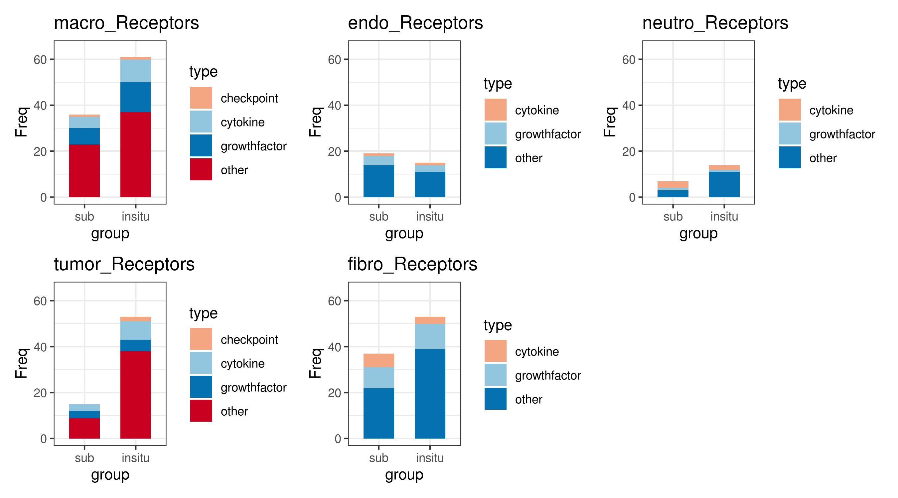

```R
all_checkpoint.csv <- list.files("./DEG_checkpoint/",pattern="_checkpoint.csv")
All_files_ <- lapply(1:length(all_checkpoint.csv),function(x){
 sel_d <- all_checkpoint.csv[x]
 tmp <- read.csv(paste0("./DEG_checkpoint/",sel_d))
 return(tmp)
 })
All_files <- do.call(rbind,All_files_)
All_files <- subset(All_files,abs(cell_from_logFC) >= 0.1)
All_files <- subset(All_files,abs(cell_to_logFC) >= 0.1)
All_files$group_Ligand <- ifelse(All_files$cell_from_logFC > 0,"Ligand_insitu","Ligand_sub")
All_files$group_Receptor <- ifelse(All_files$cell_to_logFC > 0,"Receptor_insitu","Receptor_sub")
All_files$group_LR <- paste(All_files$group_Ligand,"_",All_files$group_Receptor,sep="")
sig_checkpoint <- subset(All_files,cell_from_q.value < 0.05 | cell_to_q.value < 0.05)

all_cytokine.csv <- list.files("./DEG_cytokine/",pattern="_cytokine.csv")
All_files_ <- lapply(1:length(all_cytokine.csv),function(x){
 sel_d <- all_cytokine.csv[x]
 tmp <- read.csv(paste0("./DEG_cytokine/",sel_d))
 return(tmp)
 })
All_files <- do.call(rbind,All_files_)
All_files <- subset(All_files,abs(cell_from_logFC) >= 0.1)
All_files <- subset(All_files,abs(cell_to_logFC) >= 0.1)
All_files$group_Ligand <- ifelse(All_files$cell_from_logFC > 0,"Ligand_insitu","Ligand_sub")
All_files$group_Receptor <- ifelse(All_files$cell_to_logFC > 0,"Receptor_insitu","Receptor_sub")
All_files$group_LR <- paste(All_files$group_Ligand,"_",All_files$group_Receptor,sep="")
sig_cytokine <- subset(All_files,cell_from_q.value < 0.05 | cell_to_q.value < 0.05)

all_growthfactor.csv <- list.files("./DEG_growthfactor/",pattern="_growthfactor.csv")
All_files_ <- lapply(1:length(all_growthfactor.csv),function(x){
 sel_d <- all_growthfactor.csv[x]
 tmp <- read.csv(paste0("./DEG_growthfactor/",sel_d))
 return(tmp)
 })
All_files <- do.call(rbind,All_files_)
All_files <- subset(All_files,abs(cell_from_logFC) >= 0.1)
All_files <- subset(All_files,abs(cell_to_logFC) >= 0.1)
All_files$group_Ligand <- ifelse(All_files$cell_from_logFC > 0,"Ligand_insitu","Ligand_sub")
All_files$group_Receptor <- ifelse(All_files$cell_to_logFC > 0,"Receptor_insitu","Receptor_sub")
All_files$group_LR <- paste(All_files$group_Ligand,"_",All_files$group_Receptor,sep="")
sig_growthfactor <- subset(All_files,cell_from_q.value < 0.05 | cell_to_q.value < 0.05)

all_other.csv <- list.files("./DEG_other/",pattern="_other.csv")
All_files_ <- lapply(1:length(all_other.csv),function(x){
 sel_d <- all_other.csv[x]
 tmp <- read.csv(paste0("./DEG_other/",sel_d))
 return(tmp)
 })
All_files <- do.call(rbind,All_files_)
All_files <- subset(All_files,abs(cell_from_logFC) >= 0.1)
All_files <- subset(All_files,abs(cell_to_logFC) >= 0.1)
All_files$group_Ligand <- ifelse(All_files$cell_from_logFC > 0,"Ligand_insitu","Ligand_sub")
All_files$group_Receptor <- ifelse(All_files$cell_to_logFC > 0,"Receptor_insitu","Receptor_sub")
All_files$group_LR <- paste(All_files$group_Ligand,"_",All_files$group_Receptor,sep="")
sig_other <- subset(All_files,cell_from_q.value < 0.05 | cell_to_q.value < 0.05)

sig_checkpoint$ID <- paste(sig_checkpoint$cell_from,"_",sig_checkpoint$ligand,"_",sig_checkpoint$cell_to,"_",sig_checkpoint$receptor,sep="")
sig_cytokine$ID <- paste(sig_cytokine$cell_from,"_",sig_cytokine$ligand,"_",sig_cytokine$cell_to,"_",sig_cytokine$receptor,sep="")
sig_growthfactor$ID <- paste(sig_growthfactor$cell_from,"_",sig_growthfactor$ligand,"_",sig_growthfactor$cell_to,"_",sig_growthfactor$receptor,sep="")
sig_other$ID <- paste(sig_other$cell_from,"_",sig_other$ligand,"_",sig_other$cell_to,"_",sig_other$receptor,sep="")

sig_checkpoint <- sig_checkpoint[!duplicated(sig_checkpoint$ID),]
sig_cytokine <- sig_cytokine[!duplicated(sig_cytokine$ID),]
sig_other <- sig_other[!duplicated(sig_other$ID),]
sig_growthfactor <- sig_growthfactor[!duplicated(sig_growthfactor$ID),]


table(sig_checkpoint$group_Ligand)
table(sig_cytokine$group_Ligand)
table(sig_other$group_Ligand)
table(sig_growthfactor$group_Ligand)
table(sig_checkpoint$group_Receptor)
table(sig_cytokine$group_Receptor)
table(sig_other$group_Receptor)
table(sig_growthfactor$group_Receptor)
table(sig_checkpoint$group_LR)
table(sig_cytokine$group_LR)
table(sig_other$group_LR)
table(sig_growthfactor$group_LR)

sig_other_1 <- subset(sig_other,group_LR=="Ligand_insitu_Receptor_insitu")
sig_other_1$ligand <- as.character(sig_other_1$ligand)
sig_other_1$receptor <- as.character(sig_other_1$receptor)
sig_other_1$cell_from <- as.character(sig_other_1$cell_from)
sig_other_1$cell_to <- as.character(sig_other_1$cell_to)
sig_other_1$comm_type <- as.character(sig_other_1$comm_type)
insitu_other <- LRPlot(sig_other_1,datatype='DEG',link.arr.lwd=sig_other_1$cell_from_logFC,link.arr.width=sig_other_1$cell_to_logFC)

sig_other_1 <- subset(sig_other,group_LR=="Ligand_sub_Receptor_sub")
sig_other_1$ligand <- as.character(sig_other_1$ligand)
sig_other_1$receptor <- as.character(sig_other_1$receptor)
sig_other_1$cell_from <- as.character(sig_other_1$cell_from)
sig_other_1$cell_to <- as.character(sig_other_1$cell_to)
sig_other_1$comm_type <- as.character(sig_other_1$comm_type)
sub_other <- LRPlot(sig_other_1,datatype='DEG',link.arr.lwd=sig_other_1$cell_from_logFC,link.arr.width=sig_other_1$cell_to_logFC)

sig_cytokine_1 <- subset(sig_cytokine,group_LR=="Ligand_insitu_Receptor_insitu")
sig_cytokine_1$ligand <- as.character(sig_cytokine_1$ligand)
sig_cytokine_1$receptor <- as.character(sig_cytokine_1$receptor)
sig_cytokine_1$cell_from <- as.character(sig_cytokine_1$cell_from)
sig_cytokine_1$cell_to <- as.character(sig_cytokine_1$cell_to)
sig_cytokine_1$comm_type <- as.character(sig_cytokine_1$comm_type)
insitu_cytokine <- LRPlot(sig_cytokine_1,datatype='DEG',link.arr.lwd=sig_cytokine_1$cell_from_logFC,link.arr.width=sig_cytokine_1$cell_to_logFC)

sig_cytokine_1 <- subset(sig_cytokine,group_LR=="Ligand_sub_Receptor_sub")
sig_cytokine_1$ligand <- as.character(sig_cytokine_1$ligand)
sig_cytokine_1$receptor <- as.character(sig_cytokine_1$receptor)
sig_cytokine_1$cell_from <- as.character(sig_cytokine_1$cell_from)
sig_cytokine_1$cell_to <- as.character(sig_cytokine_1$cell_to)
sig_cytokine_1$comm_type <- as.character(sig_cytokine_1$comm_type)
sub_cytokine <- LRPlot(sig_cytokine_1,datatype='DEG',link.arr.lwd=sig_cytokine_1$cell_from_logFC,link.arr.width=sig_cytokine_1$cell_to_logFC)

sig_growthfactor_1 <- subset(sig_growthfactor,group_LR=="Ligand_insitu_Receptor_insitu")
sig_growthfactor_1$ligand <- as.character(sig_growthfactor_1$ligand)
sig_growthfactor_1$receptor <- as.character(sig_growthfactor_1$receptor)
sig_growthfactor_1$cell_from <- as.character(sig_growthfactor_1$cell_from)
sig_growthfactor_1$cell_to <- as.character(sig_growthfactor_1$cell_to)
sig_growthfactor_1$comm_type <- as.character(sig_growthfactor_1$comm_type)
insitu_growthfactor <- LRPlot(sig_growthfactor_1,datatype='DEG',link.arr.lwd=sig_growthfactor_1$cell_from_logFC,link.arr.width=sig_growthfactor_1$cell_to_logFC)

sig_growthfactor_1 <- subset(sig_growthfactor,group_LR=="Ligand_sub_Receptor_sub")
sig_growthfactor_1$ligand <- as.character(sig_growthfactor_1$ligand)
sig_growthfactor_1$receptor <- as.character(sig_growthfactor_1$receptor)
sig_growthfactor_1$cell_from <- as.character(sig_growthfactor_1$cell_from)
sig_growthfactor_1$cell_to <- as.character(sig_growthfactor_1$cell_to)
sig_growthfactor_1$comm_type <- as.character(sig_growthfactor_1$comm_type)
sub_growthfactor <- LRPlot(sig_growthfactor_1,datatype='DEG',link.arr.lwd=sig_growthfactor_1$cell_from_logFC,link.arr.width=sig_growthfactor_1$cell_to_logFC)

sig_checkpoint_1 <- subset(sig_checkpoint,group_LR=="Ligand_insitu_Receptor_insitu")
sig_checkpoint_1$ligand <- as.character(sig_checkpoint_1$ligand)
sig_checkpoint_1$receptor <- as.character(sig_checkpoint_1$receptor)
sig_checkpoint_1$cell_from <- as.character(sig_checkpoint_1$cell_from)
sig_checkpoint_1$cell_to <- as.character(sig_checkpoint_1$cell_to)
sig_checkpoint_1$comm_type <- as.character(sig_checkpoint_1$comm_type)
insitu_checkpoint <- LRPlot(sig_checkpoint_1,datatype='DEG',link.arr.lwd=sig_checkpoint_1$cell_from_logFC,link.arr.width=sig_checkpoint_1$cell_to_logFC)

sig_checkpoint_1 <- subset(sig_checkpoint,group_LR=="Ligand_sub_Receptor_sub")
sig_checkpoint_1$ligand <- as.character(sig_checkpoint_1$ligand)
sig_checkpoint_1$receptor <- as.character(sig_checkpoint_1$receptor)
sig_checkpoint_1$cell_from <- as.character(sig_checkpoint_1$cell_from)
sig_checkpoint_1$cell_to <- as.character(sig_checkpoint_1$cell_to)
sig_checkpoint_1$comm_type <- as.character(sig_checkpoint_1$comm_type)
sub_checkpoint <- LRPlot(sig_checkpoint_1,datatype='DEG',link.arr.lwd=sig_checkpoint_1$cell_from_logFC,link.arr.width=sig_checkpoint_1$cell_to_logFC)

```


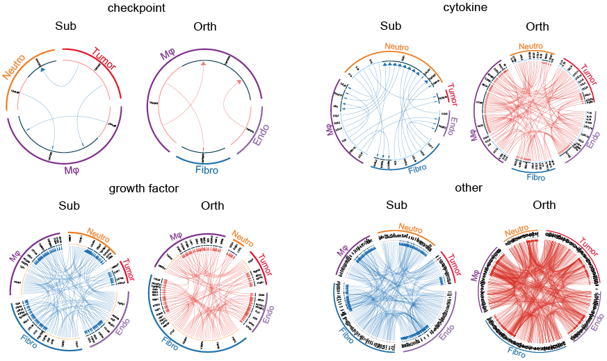


#### Cell interaction strength  analyses

```R
ins_fibro_ligand <- read.csv("./forbarplot_insitu_fibro_ligand_expr_score.csv")
sub_fibro_ligand <- read.csv("./forbarplot_sub_fibro_ligand_expr_score.csv")
all_fibro_ligand<- cbind(ins_fibro_ligand,sub_fibro_ligand)
all_fibro_ligand$diff <- ins_fibro_ligand$fibro_ligand_expr - sub_fibro_ligand$fibro_ligand_expr
all_fibro_ligand <- all_fibro_ligand[order(-all_fibro_ligand[,5]),] 
all_fibro_ligand$cell_type <- "fibro"
all_fibro_ligand$cell_ligand <- paste(all_fibro_ligand$cell_type,sep="_",all_fibro_ligand$X)

ins_macro_ligand <- read.csv("./forbarplot_insitu_macro_ligand_expr_score.csv")
sub_macro_ligand <- read.csv("./forbarplot_sub_macro_ligand_expr_score.csv")
all_macro_ligand<- cbind(ins_macro_ligand,sub_macro_ligand)
all_macro_ligand$diff <- ins_macro_ligand$macro_ligand_expr - sub_macro_ligand$macro_ligand_expr
all_macro_ligand <- all_macro_ligand[order(-all_macro_ligand[,5]),] 
all_macro_ligand$cell_type <- "macro"
all_macro_ligand$cell_ligand <- paste(all_macro_ligand$cell_type,sep="_",all_macro_ligand$X)

ins_endo_ligand <- read.csv("./forbarplot_insitu_endo_ligand_expr_score.csv")
sub_endo_ligand <- read.csv("./forbarplot_sub_endo_ligand_expr_score.csv")
all_endo_ligand<- cbind(ins_endo_ligand,sub_endo_ligand)
all_endo_ligand$diff <- ins_endo_ligand$endo_ligand_expr - sub_endo_ligand$endo_ligand_expr
all_endo_ligand <- all_endo_ligand[order(-all_endo_ligand[,5]),] 
all_endo_ligand$cell_type <- "endo"
all_endo_ligand$cell_ligand <- paste(all_endo_ligand$cell_type,sep="_",all_endo_ligand$X)

ins_neutro_ligand <- read.csv("./forbarplot_insitu_neutro_ligand_expr_score.csv")
sub_neutro_ligand <- read.csv("./forbarplot_sub_neutro_ligand_expr_score.csv")
all_neutro_ligand<- cbind(ins_neutro_ligand,sub_neutro_ligand)
all_neutro_ligand$diff <- ins_neutro_ligand$neutro_ligand_expr - sub_neutro_ligand$neutro_ligand_expr
all_neutro_ligand <- all_neutro_ligand[order(-all_neutro_ligand[,5]),] 
all_neutro_ligand$cell_type <- "neutro"
all_neutro_ligand$cell_ligand <- paste(all_neutro_ligand$cell_type,sep="_",all_neutro_ligand$X)

all_fibro_ligand <- all_fibro_ligand[,c(1,2,4,5,6,7)]
all_macro_ligand <- all_macro_ligand[,c(1,2,4,5,6,7)]
all_endo_ligand <- all_endo_ligand[,c(1,2,4,5,6,7)]
all_neutro_ligand <- all_neutro_ligand[,c(1,2,4,5,6,7)]
names(all_fibro_ligand) <- c("Symbol","Ligand_Rel_Exp_in_Orth","Ligand_Rel_Exp_in_Sub","Exp_Differences","CellType","Cell_Ligand")
names(all_macro_ligand) <- c("Symbol","Ligand_Rel_Exp_in_Orth","Ligand_Rel_Exp_in_Sub","Exp_Differences","CellType","Cell_Ligand")
names(all_endo_ligand) <- c("Symbol","Ligand_Rel_Exp_in_Orth","Ligand_Rel_Exp_in_Sub","Exp_Differences","CellType","Cell_Ligand")
names(all_neutro_ligand) <- c("Symbol","Ligand_Rel_Exp_in_Orth","Ligand_Rel_Exp_in_Sub","Exp_Differences","CellType","Cell_Ligand")
Candidate_200_Ligands <- rbind(all_neutro_ligand,all_endo_ligand,all_fibro_ligand,all_macro_ligand)
write.csv(Candidate_200_Ligands,"200_Candidate_Ligands.csv")

Candidate_Ligands <- read.csv("./200_Candidate_Ligands.csv")
Candidate_Ligands <- Candidate_Ligands[order(-Candidate_Ligands$Exp_Differences),] 
Candidate_Ligands$high_low <- ifelse(Candidate_Ligands$Exp_Differences > 0,"high","low")
ff <- ggdotchart(Candidate_Ligands, x = "Cell_Ligand", y = "Exp_Differences",
           color = "high_low",                              
           palette = c("#ef3b2c","#6baed6"),
           sorting = "descending",                       
           add = "segments",                             
           rotate = TRUE,                              
           dot.size = 10,                              
           label = round(Candidate_Ligands$Exp_Differences),                       
           font.label = list(color = "white", size = 0, vjust = 0.3),              
           ggtheme = theme_pubr())+ylim(-400,400)
ggsave(ff,file="FigS5_lolipop_200Ligang_genes.png",height=30,width=20,dpi=720)
```


```R
receptor_genelist_DB <- read.csv("./receptor_genelist_DB.csv")
everygroup_markers <- read.csv("./everygroup_markers.csv")
tumor_cell_high <- subset(everygroup_markers,cluster=="0" | cluster=="2")
tumor_cell_high <- tumor_cell_high[!duplicated(tumor_cell_high$gene),]
rownames(tumor_cell_high) <- tumor_cell_high$gene
aa <- tumor_cell_high %>% rownames() %>% convert_mouse_to_human_symbols()
tumor_cell_high$human_symbol <- as.character(aa)
tumor_cell_high <- tumor_cell_high[!duplicated(tumor_cell_high$human_symbol),]
tumor_cell_high <- na.omit(tumor_cell_high)
tumor_high_weight_receptor_genes <- merge(receptor_genelist_DB,tumor_cell_high,by.x="all_receptor_genelist",by.y="human_symbol")
tumor_high_weight_receptor_genes <- tumor_high_weight_receptor_genes[order(-tumor_high_weight_receptor_genes[,5]),] #按第一列递增排序
tumor_high_weight_receptor_genes <- tumor_high_weight_receptor_genes[,c("all_receptor_genelist","p_val","p_val_adj","avg_logFC","pct.1","pct.2")]
names(tumor_high_weight_receptor_genes) <- c("Candidate_Receptors","Tumor_VS_nonTumor_p_val","Tumor_VS_nonTumor_p_val_adj","Tumor_VS_nonTumor_avg_logFC","Tumor_pct.1","nonTumor_pct.2")
tumor_high_weight_receptor_genes <- tumor_high_weight_receptor_genes[order(-tumor_high_weight_receptor_genes$Tumor_VS_nonTumor_avg_logFC),] 
tumor_high_weight_receptor_genes$Receptor_celltype_genes <- paste("tumor","_",tumor_high_weight_receptor_genes$Candidate_Receptors,sep="")
ff <- ggdotchart(tumor_high_weight_receptor_genes, 
           x="Candidate_Receptors", 
           y="Tumor_VS_nonTumor_avg_logFC", 
           color = "red",
           palette = "npg",
           sorting = "descending",
           add = "segments", dot.size = 3)
ggsave(ff,file="FigS5_26genes_weight_tumor.png",height=4,width=4,dpi=1080)
```

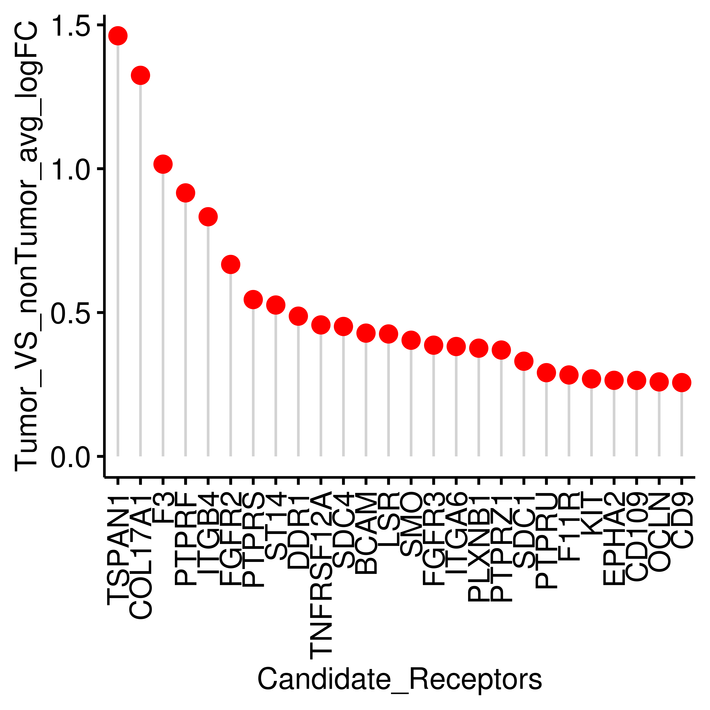

```R
all_other.csv <- list.files("./DEG_other",pattern="_other.csv")
All_files_ <- lapply(1:length(all_other.csv),function(x){
 sel_d <- all_other.csv[x]
 tmp <- read.csv(paste0("./DEG_other/",sel_d))
 return(tmp)
 })
All_files <- do.call(rbind,All_files_)
All_files$cell_from <- as.character(All_files$cell_from)
All_files$cell_to <- as.character(All_files$cell_to)
All_files$ligand <- as.character(All_files$ligand)
All_files$receptor <- as.character(All_files$receptor)
other_files <- All_files

all_checkpoint.csv <- list.files("./DEG_checkpoint",pattern="_checkpoint.csv")
All_files_ <- lapply(1:length(all_checkpoint.csv),function(x){
 sel_d <- all_checkpoint.csv[x]
 tmp <- read.csv(paste0("./DEG_checkpoint/",sel_d))
 return(tmp)
 })
All_files <- do.call(rbind,All_files_)
All_files$cell_from <- as.character(All_files$cell_from)
All_files$cell_to <- as.character(All_files$cell_to)
All_files$ligand <- as.character(All_files$ligand)
All_files$receptor <- as.character(All_files$receptor)
checkpoint_files <- All_files


all_growthfactor.csv <- list.files("./DEG_growthfactor",pattern="_growthfactor.csv")
All_files_ <- lapply(1:length(all_growthfactor.csv),function(x){
 sel_d <- all_growthfactor.csv[x]
 tmp <- read.csv(paste0("./DEG_growthfactor/",sel_d))
 return(tmp)
 })
All_files <- do.call(rbind,All_files_)
All_files$cell_from <- as.character(All_files$cell_from)
All_files$cell_to <- as.character(All_files$cell_to)
All_files$ligand <- as.character(All_files$ligand)
All_files$receptor <- as.character(All_files$receptor)
growthfactor_files <- All_files

all_cytokine.csv <- list.files("./DEG_cytokine",pattern="_cytokine.csv")
All_files_ <- lapply(1:length(all_cytokine.csv),function(x){
 sel_d <- all_cytokine.csv[x]
 tmp <- read.csv(paste0("./DEG_cytokine/",sel_d))
 return(tmp)
 })
All_files <- do.call(rbind,All_files_)
All_files$cell_from <- as.character(All_files$cell_from)
All_files$cell_to <- as.character(All_files$cell_to)
All_files$ligand <- as.character(All_files$ligand)
All_files$receptor <- as.character(All_files$receptor)
cytokine_files <- All_files
all_diff_LR <- rbind(cytokine_files,growthfactor_files,checkpoint_files,other_files)

cell_from_qvalue_logFC <- subset(all_diff_LR,cell_from_q.value < 0.05 & abs(cell_from_logFC) > 0.25)
TME_to_Tumor_sig_LR <- subset(cell_from_qvalue_logFC,cell_from != "tumor" & cell_to =="tumor")
TME_to_Tumor_sig_LR$Ligand_celltype_genes <- paste(TME_to_Tumor_sig_LR$cell_from,"_",TME_to_Tumor_sig_LR$ligand,sep="")
TME_to_Tumor_sig_LR$Receptor_celltype_genes <- paste(TME_to_Tumor_sig_LR$cell_to,"_",TME_to_Tumor_sig_LR$receptor,sep="")
TME_to_Tumor_sig_LR <- TME_to_Tumor_sig_LR[,c("Ligand_celltype_genes","Receptor_celltype_genes")]

Candidate_Ligands <- read.csv("./200_Candidate_Ligands.csv")
nonTumor_Ligands <- Candidate_Ligands
tmp <- merge(TME_to_Tumor_sig_LR,nonTumor_Ligands,by.x="Ligand_celltype_genes",by.y="Cell_Ligand")
Candidate_LR_interaction <- merge(tmp,tumor_high_weight_receptor_genes,by="Receptor_celltype_genes")
Candidate_LR_interaction$LR_score <- Candidate_LR_interaction$Exp_Differences*Candidate_LR_interaction$Tumor_VS_nonTumor_avg_logFC
Candidate_LR_interaction <- Candidate_LR_interaction[order(-Candidate_LR_interaction$LR_score),] 
Candidate_LR_interaction$LR <- paste(Candidate_LR_interaction$Ligand_celltype_genes,"_",Candidate_LR_interaction$Receptor_celltype_genes,sep="")
Candidate_LR_interaction <- Candidate_LR_interaction[!duplicated(Candidate_LR_interaction$LR),]
write.csv(Candidate_LR_interaction,"49paired_Candidate_LR_interaction.csv")

tmp_LR_data <- data.frame(Candidate_LR_interaction$LR,Candidate_LR_interaction$LR_score)
names(tmp_LR_data) <- c("LR","score")
score_high <- subset(tmp_LR_data,score>0)
score_low <- subset(tmp_LR_data,score<0)
score_high$group <- 1
score_low$group <- -1
tmp_LR_data <- rbind(score_high,score_low)
library("ggplot2")
ff <- ggplot(tmp_LR_data, aes(x=reorder(LR,order(score, decreasing = F)), y=score, fill=group)) + 
    geom_bar(stat="identity") + 
    scale_fill_gradient(low="blue",high="red") + 
    coord_flip()+scale_y_continuous(name ="score")+scale_x_discrete(name ="LR")+ylim(-100,100)
ggsave(ff,file="Fig5_LR_final_score.png",width=6,height=4,dpi=1080)
```

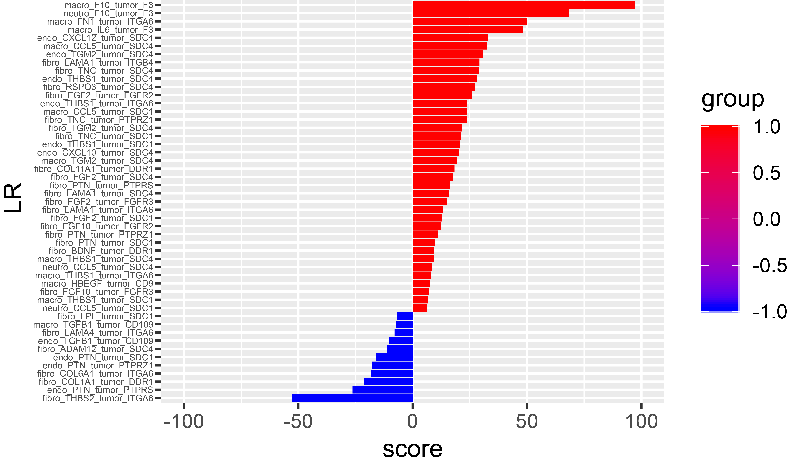


```R
Tumor_cells <- readRDS("./Orth_and_Sub_Tumor_cells.rds")
A6B4 <- c("Itga6","Itgb4")
A6B4 <- intersect(rownames(GetAssayData(object = Tumor_cells)),A6B4)
speci_raw <- FetchData(object = Tumor_cells, vars = A6B4)
Tumor_cells[["A6B4"]] <- (rowSums(speci_raw))/length(A6B4)
A6B4_expr <- data.frame(Tumor_cells@meta.data[c(1,8)])
A6B4_expr$orig.ident = factor(A6B4_expr$orig.ident, levels=c("sub","in_situ"))
my_comparisons <- list(c("in_situ","sub"))
p1 <- ggboxplot(A6B4_expr, x = "orig.ident", y = "A6B4", color = "orig.ident")+ylim(0,4.5)+
  stat_compare_means(comparisons = my_comparisons, label = "p.format",method="wilcox.test",paired=FALSE) # Add significance levels 
ggsave("Figure5_A6B4_in_Tumorcells.png", plot=p1,width =4,height = 6,dpi=1080)
```


```R
Macro_cells <- readRDS("./Orth_and_Sub_Macrophages.rds")
Fn1 <- c("Fn1")
Fn1 <- intersect(rownames(GetAssayData(object = Macro_cells)),Fn1)
speci_raw <- FetchData(object = Macro_cells, vars = Fn1)
Macro_cells[["Fn1"]] <- (rowSums(speci_raw))/length(Fn1)
Fn1_expr <- data.frame(Macro_cells@meta.data[c(1,8)])
Fn1_expr$orig.ident = factor(Fn1_expr$orig.ident, levels=c("sub","in_situ"))
my_comparisons <- list(c("in_situ","sub"))
p1 <- ggboxplot(Fn1_expr, x = "orig.ident", y = "Fn1", color = "orig.ident")+ylim(0,4.5)+
  stat_compare_means(comparisons = my_comparisons, label = "p.format",method="wilcox.test",paired=FALSE) # Add significance levels 
ggsave("Figure5_Fn1_in_Macro.png", plot=p1,width =4,height = 6,dpi=1080)
```

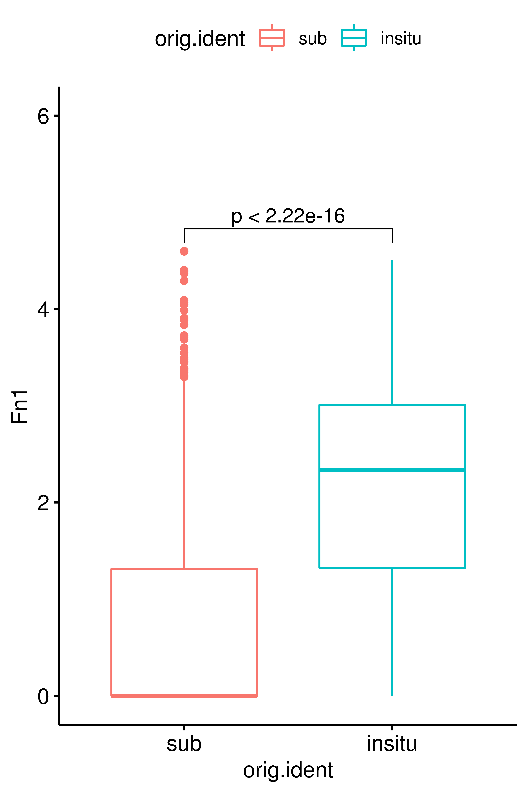

### Part 4. Macrophage analyses

```R
Merge_umap_res20_rename <- readRDS("./Merge_umap_res20_rename.rds")
Macrophage <- subset(Merge_umap_res20_rename,celltype=="Macrophage")
range(Macrophage@meta.data$nCount_RNA)
range(Macrophage@meta.data$nFeature_RNA)

macro_object <- CreateSeuratObject(counts =GetAssayData(object = Macrophage, slot = "counts",assay="RNA")[,rownames(Macrophage@meta.data)], meta.data = Macrophage@meta.data)
macro_object[["percent.mt"]] <- PercentageFeatureSet(macro_object, pattern = "^mt-")

macro_subset <- subset(macro_object, subset = nFeature_RNA > 500 & nFeature_RNA < 7500 & nCount_RNA > 2000 & percent.mt < 25)
macro_normalize <- NormalizeData(macro_subset)
macro_normalize_variable_features <- FindVariableFeatures(macro_normalize, selection.method = "vst", nfeatures = 7500)
all.genes <- rownames(macro_normalize_variable_features)
macro_variable_scale <- ScaleData(macro_normalize_variable_features,verbose = TRUE, vars.to.regress = c("nCount_RNA","orig.ident"))
macro_pca <- RunPCA(macro_variable_scale, features = VariableFeatures(object = macro_variable_scale))
macro_JackStraw <- JackStraw(macro_pca, num.replicate = 100)
macro_ScoreJackStraw <- ScoreJackStraw(macro_JackStraw, dims = 1:20)
Macro_FindNeighbors <- FindNeighbors(macro_ScoreJackStraw, dims = 1:10)
Macro_FindClusters <- FindClusters(Macro_FindNeighbors, resolution = 0.3)
Macro_umap10 <- RunUMAP(Macro_FindClusters, reduction = "pca",dim.embed = 2,reduction.name = "umap",dims=1:10)

# Subpopulations with cell numbers less than 150 were filtered out
Macro_rest <- subset(Macro_umap10,idents=c(0,1,2,3))
umap_POS <- as.data.frame(Macro_rest[["umap"]]@cell.embeddings)
filter1 <- rownames(subset(umap_POS,UMAP_1 < -4 | UMAP_2 > 3.7 | UMAP_2 < -5))
filter2 <- rownames(subset(umap_POS,UMAP_1 < -2.55 & UMAP_2 > 2.4))
filter <- c(filter1,filter2)
Macro_Final_Merge <- subset(Macro_rest,cell=setdiff(rownames(umap_POS),filter))
new.cluster.ids <- c("C1qc+","Arg1+","Spp1+","Ly6c2+")
names(new.cluster.ids) <- levels(Macro_Final_Merge)
Macro_Final_Merge_rename <- RenameIdents(Macro_Final_Merge, new.cluster.ids)
Macro_Final_Merge_rename$sub_group <- Idents(Macro_Final_Merge_rename)
Macrophages_data <- Macro_Final_Merge_rename
saveRDS(Macrophages_data,"Macrophages.rds")

Macrophages_data <- readRDS("./Macrophages.rds")
Macro_markers <- FindAllMarkers(Macrophages_data, only.pos = TRUE, min.pct = 0.25, logfc.threshold = 0.25)
write.csv(Macro_markers,"Macrophages_FindMarkers.csv")

p1 <- DimPlot(Macrophages_data, reduction = "umap",label = TRUE,pt.size=1,label.size=7,cols=c("#377eb8","#e41a1c","#984ea3","#4daf4a"))
ggsave(p1,file="Fig5_Macrophages_UMAP.png",width=6.4,height=6,dpi=1080)
```

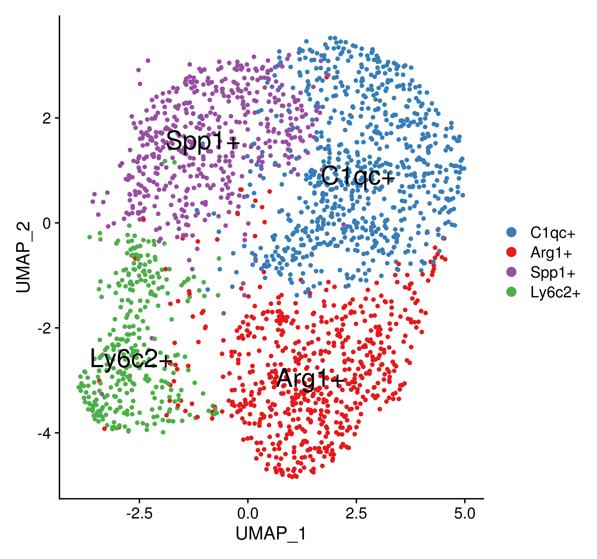

```R
Idents(Macrophages_data) <- factor(Idents(Macrophages_data), levels = c("C1qc+","Arg1+","Spp1+","Ly6c2+"))
markers.to.plot <- c("C1qc","C1qb","C1qa","Arg1","Inhba","Fn1","Spp1","Ly6c2")
names(new.cluster.ids) <- levels(Macrophages_data)
p2 <- DotPlot(Macrophages_data, features = c("C1qc","C1qb","C1qa","Arg1","Inhba","Fn1","Spp1","Ly6c2"),cols=c("#ffffff","#B30000"),scale = TRUE,col.min = 0.5,col.max = 3) + RotatedAxis()
ggsave(p2,file="FigS5_Dotplot_Macro.png",width=5.5,height=2.5,dpi=1080)
```

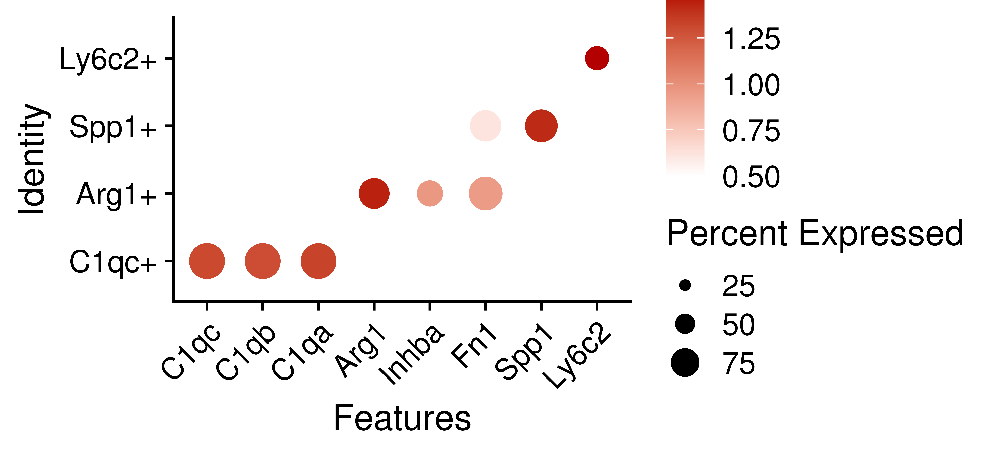

```R
Idents(Macrophages_data) <- Macrophages_data$sub_group
sub_group <- data.frame(Macrophages_data@active.ident)
names(sub_group) <- "sub_group"
sub_group$barcodes <- rownames(sub_group)
meta.data <- as.data.frame(Macrophages_data[[]])
meta.data$sub_group <- sub_group$sub_group
y <- meta.data[,1]
insitu_metadata <- meta.data[with(meta.data,y=="insitu"),]
y <- meta.data[,1]
sub_metadata <- meta.data[with(meta.data,y=="sub"),]
cluster_all <- c()
celltype <- c("Arg1+","C1qc+","Spp1+","Ly6c2+")
i <- c(1:4)
for (i in celltype[i]){
y <- insitu_metadata[,"sub_group"]
insitu_cluster <- insitu_metadata[with(insitu_metadata,y==i),]
y <- sub_metadata[,"sub_group"]
sub_cluster <- sub_metadata[with(sub_metadata,y==i),]
insitu_per <- nrow(insitu_cluster)/nrow(insitu_metadata)
sub_per <- nrow(sub_cluster)/nrow(sub_metadata)
aa <- as.data.frame(c(insitu_per,sub_per))
rownames(aa) <- c("insitu_per","sub_per")
colnames(aa) <- paste("clu",i,sep="_")
aa <- as.data.frame(t(aa))
cluster_all <- rbind(cluster_all,aa)
print(paste("clu",i,"is done",sep=" "))
}
cluster_all <- round(cluster_all,4)
cluster_all
cluster_all$cluster <- rownames(cluster_all)
cluster_all_1 <- data.frame(cluster_all)
denominator <- cluster_all_1$insitu_per+cluster_all_1$sub_per
insitu_ratio <- cluster_all_1$insitu_per/denominator
sub_ratio <- cluster_all_1$sub_per/denominator
cluster <- cluster_all_1$cluster
insitu_cluratio <- data.frame(cbind(insitu_ratio,cluster))
insitu_cluratio$ratio <- insitu_cluratio$insitu_ratio
insitu_cluratio <- insitu_cluratio[,-1]
insitu_cluratio$sample <- "insitu"
sub_cluratio <- data.frame(cbind(sub_ratio,cluster))
sub_cluratio$ratio <- sub_cluratio$sub_ratio
sub_cluratio <- sub_cluratio[,-1]
sub_cluratio$sample <- "sub"
percentage_cluster <- rbind(insitu_cluratio,sub_cluratio)
percentage_cluster$cluster = factor(percentage_cluster$cluster, levels=c("clu_Arg1+","clu_Spp1+","clu_Ly6c2+","clu_C1qc+")) 
ff <- ggplot(percentage_cluster,aes(cluster,ratio,fill=sample))+geom_bar(stat ="identity",position="stack")+
labs(title="cluster ratio",y="ratio")+
theme(plot.title = element_text(size=20,face = "bold"),axis.text.y=element_text(size=15),
axis.text.x=element_text(size=10),axis.title.y=element_text(size=15,face="bold"),axis.title.x=element_text(size=15,face="bold"))
ggsave(ff,file="Fig5_Macro_subgroup_percentage_cluster.png",width = 5, height = 5,dpi=1080)
```

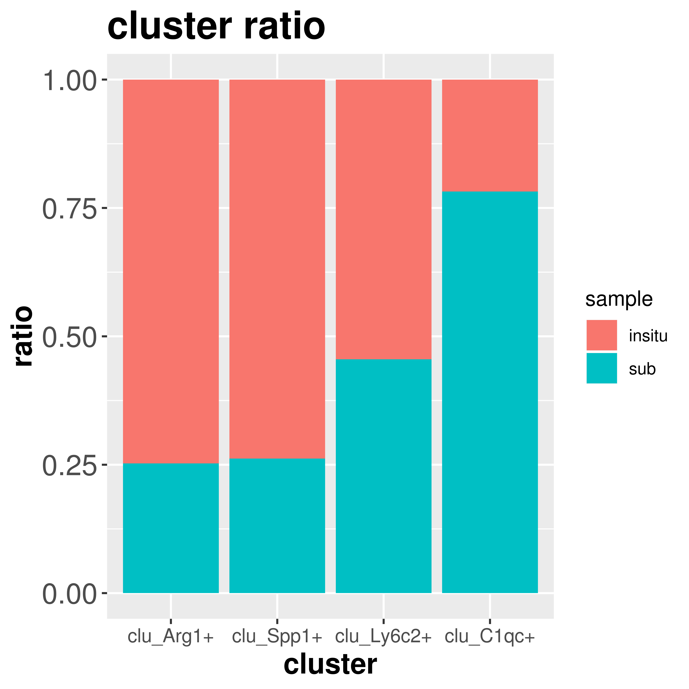

```R
Macro_sig <- read.csv("./Macrophage_gene_signatures.csv")
gene <- as.vector(Macro_sig$Symbol)
Macro_sig = Macro_sig %>% mutate(mouse_gene = convert_human_to_mouse_symbols(gene))
Macro_sig <- na.omit(Macro_sig)

M1_sig <- subset(Macro_sig,signature_genes=="M1")
M1_sig <- as.character(M1_sig$mouse_gene)
M1_sig <- intersect(rownames(GetAssayData(object = Macrophages_data)),M1_sig)
speci_raw <- FetchData(object = Macrophages_data, vars = M1_sig)
Macrophages_data[["M1_sig"]] <- (rowSums(speci_raw))/length(M1_sig)

M2_sig <- subset(Macro_sig,signature_genes=="M2")
M2_sig <- as.character(M2_sig$mouse_gene)
M2_sig <- intersect(rownames(GetAssayData(object = Macrophages_data)),M2_sig)
speci_raw <- FetchData(object = Macrophages_data, vars = M2_sig)
Macrophages_data[["M2_sig"]] <- (rowSums(speci_raw))/length(M2_sig)

MAM_sig <- subset(Macro_sig,signature_genes=="MAM")
MAM_sig <- as.character(MAM_sig$mouse_gene)
MAM_sig <- intersect(rownames(GetAssayData(object = Macrophages_data)),MAM_sig)
speci_raw <- FetchData(object = Macrophages_data, vars = MAM_sig)
Macrophages_data[["MAM_sig"]] <- (rowSums(speci_raw))/length(MAM_sig)

Angiogenesis_sig <- subset(Macro_sig,signature_genes=="Angiogenesis")
Angiogenesis_sig <- as.character(Angiogenesis_sig$mouse_gene)
Angiogenesis_sig <- intersect(rownames(GetAssayData(object = Macrophages_data)),Angiogenesis_sig)
speci_raw <- FetchData(object = Macrophages_data, vars = Angiogenesis_sig)
Macrophages_data[["Angiogenesis_sig"]] <- (rowSums(speci_raw))/length(Angiogenesis_sig)

Phagocytosis_sig <- subset(Macro_sig,signature_genes=="Phagocytosis")
Phagocytosis_sig <- as.character(Phagocytosis_sig$mouse_gene)
Phagocytosis_sig <- intersect(rownames(GetAssayData(object = Macrophages_data)),Phagocytosis_sig)
speci_raw <- FetchData(object = Macrophages_data, vars = Phagocytosis_sig)
Macrophages_data[["Phagocytosis_sig"]] <- (rowSums(speci_raw))/length(Phagocytosis_sig)

Phagocytosis_sig <- as.character(Phagocytosis_sig$mouse_gene)
Phagocytosis_sig <- intersect(rownames(GetAssayData(object = Macrophages_data)),Phagocytosis_sig)
speci_raw <- FetchData(object = Macrophages_data, vars = Phagocytosis_sig)
Macrophages_data[["Phagocytosis_sig"]] <- (rowSums(speci_raw))/length(Phagocytosis_sig)

Fn1_expr <- as.character("Fn1")
Fn1_expr <- intersect(rownames(GetAssayData(object = Macrophages_data)),Fn1_expr)
speci_raw <- FetchData(object = Macrophages_data, vars = Fn1_expr)
Macrophages_data[["Fn1_expr"]] <- (rowSums(speci_raw))/length(Fn1_expr)

Macro_meta <- data.frame(Macrophages_data@meta.data)
Macro_meta <- Macro_meta[,c("sample","sub_group","Fn1_expr","M1_sig","M2_sig","MAM_sig","Angiogenesis_sig","Phagocytosis_sig")]
my_comparisons <- list(c("Arg1+","C1qc+"),c("Arg1+","Spp1+"),c("Arg1+","Ly6c2+"))
```

```R
library(ggpubr)
ff <- ggboxplot(Macro_meta, x = "sub_group", y = "M1_sig",
               color = "sub_group",
                add = "jitter") +
stat_compare_means(comparisons = my_comparisons,method="wilcox.test") 
ggsave(ff,file="M1_sig_expr.png",dpi=1080,height=4,width=5)
```

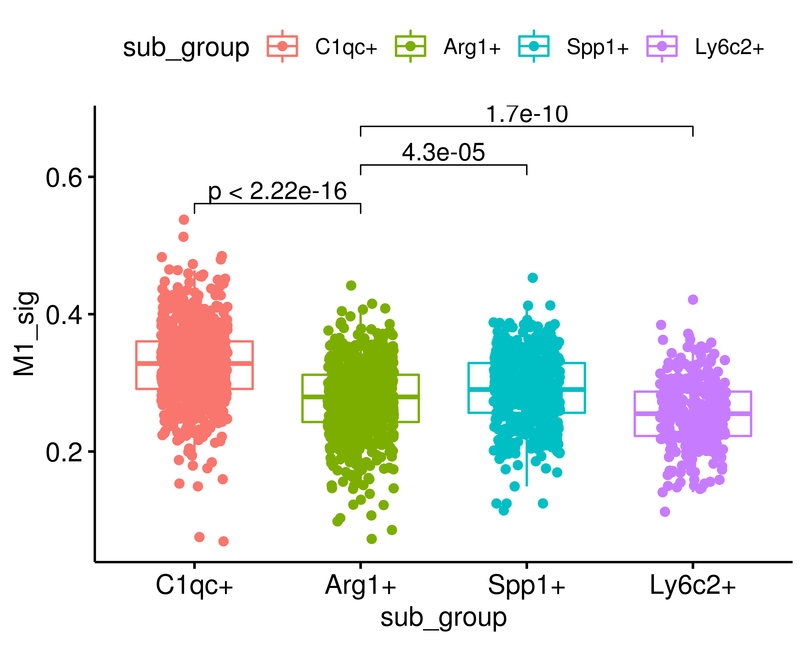

```R
ff <- ggboxplot(Macro_meta, x = "sub_group", y = "M2_sig",
               color = "sub_group",
                add = "jitter") +
stat_compare_means(comparisons = my_comparisons,method="wilcox.test") 
ggsave(ff,file="M2_sig_expr.png",dpi=1080,height=4,width=5)
```

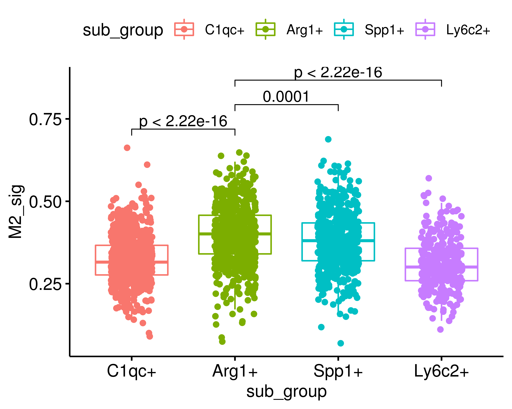

```R
ff <- ggboxplot(data, x = "sub_group", y = "MAM_sig",
               color = "sub_group",
                add = "jitter") +
stat_compare_means(comparisons = my_comparisons,method="wilcox.test")
ggsave(ff,file="MAM_sig_boxplot.png",width=4,height=5,dpi=1080)
```

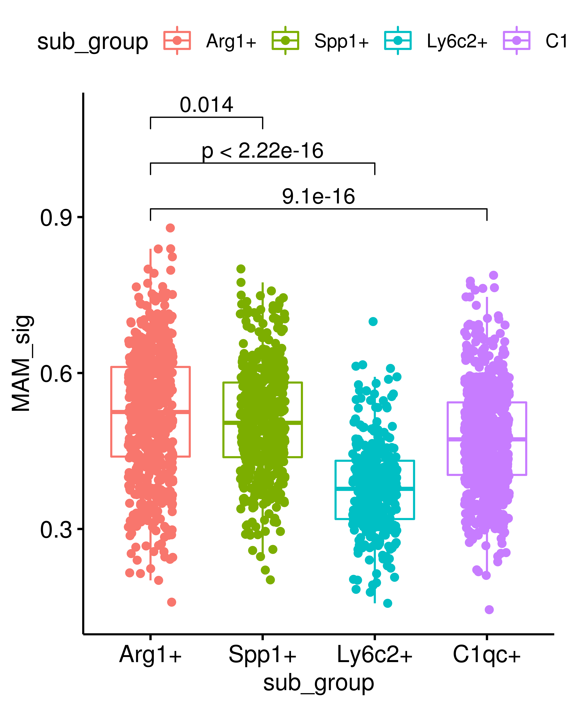

```R
ff <- ggboxplot(Macro_meta, x = "sub_group", y = "Angiogenesis_sig",
               color = "sub_group",
                add = "jitter") +
stat_compare_means(comparisons = my_comparisons,method="wilcox.test") 
ggsave(ff,file="Angio_sig_expr.png",dpi=1080,height=4,width=5)
```

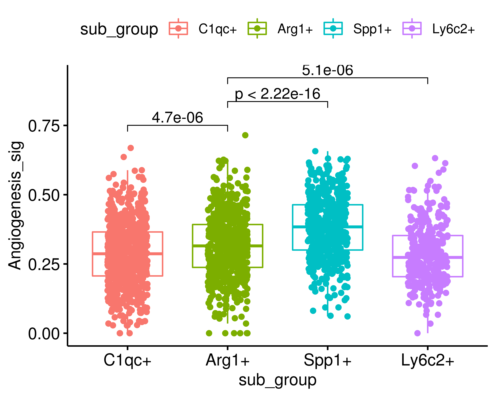

```R
ff <- ggboxplot(Macro_meta, x = "sub_group", y = "Phagocytosis_sig",
               color = "sub_group",
                add = "jitter") +
stat_compare_means(comparisons = my_comparisons,method="wilcox.test") 
ggsave(ff,file="Phago_sig_expr_TandN.png",dpi=1080,height=4,width=5)
```

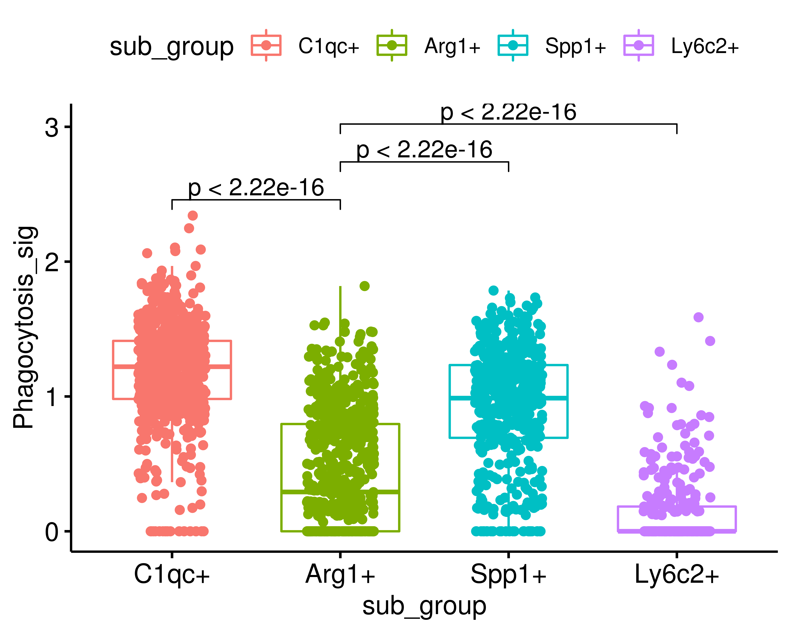

```R
ff <- ggboxplot(Macro_meta, x = "sub_group", y = "Fn1_expr",
               color = "sub_group",
                add = "jitter") +
stat_compare_means(comparisons = my_comparisons,method="wilcox.test") 
ggsave(ff,file="Fn1_expr.png",dpi=1080,height=4,width=5)
```

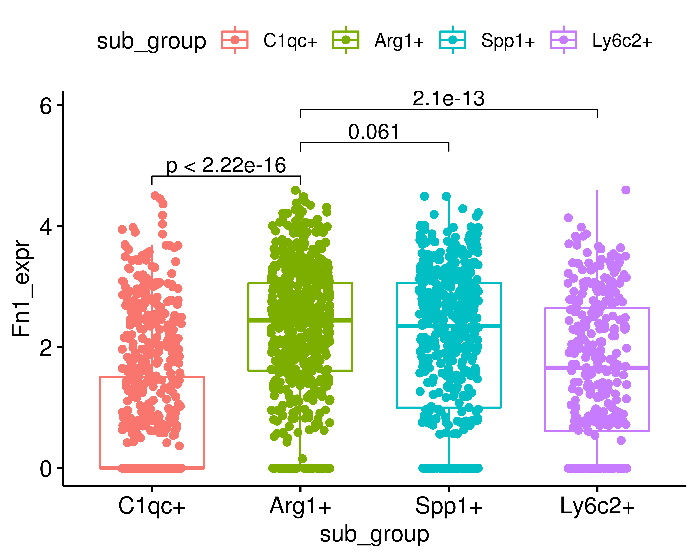
